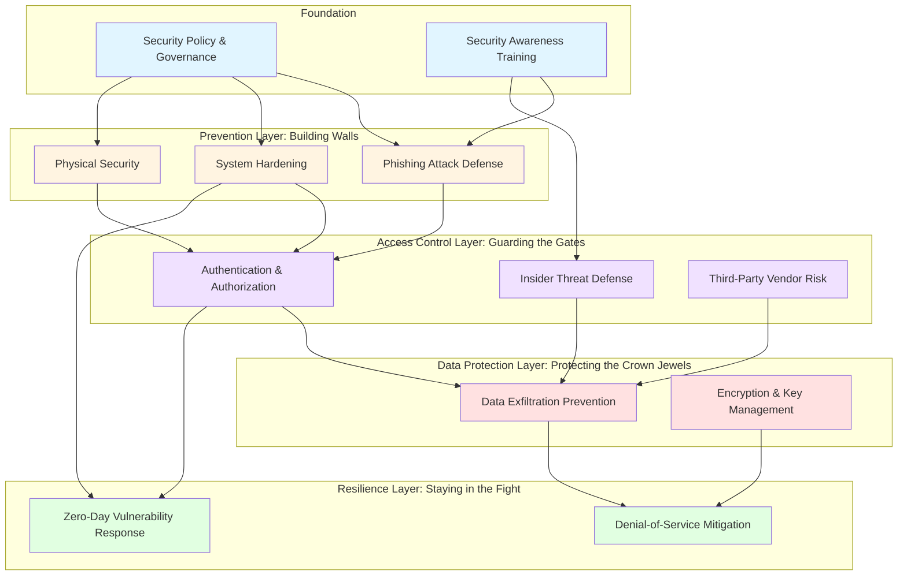

# Framework Architecture: How the Pieces Fit Together

## Overview

The 12 defensible frameworks map to all 272 PCI DSS v4.0.1 requirements while organizing them by attacker objective rather than control type. This architecture ensures that compliance activities directly contribute to breach prevention.

## Framework Categories and Relationships

The frameworks form a defensive architecture with four layers and a foundation:

## Layer Descriptions

### Foundation: Making Security Stick

These frameworks enable all other security controls:

**Security Policy & Governance** establishes the rules, processes, and accountability structures that institutionalize security. Without governance, security becomes dependent on individual heroes rather than systematic processes.

**Security Awareness Training** addresses the human element. Technical controls fail when users click phishing links, share credentials, or bypass security for convenience. Training builds security instincts that complement technical defenses.

### Prevention: Building Walls

These frameworks reduce attack surface and initial compromise probability:

**Phishing Attack Defense** prevents credential theft and initial access, the most common breach entry vector. Four defensive layers ensure that successful phishing requires multiple simultaneous control failures.

**System Hardening** reduces attack surface by removing unnecessary services, enforcing secure configurations, and implementing defense-in-depth at the system level. Hardened systems resist exploitation even when vulnerabilities exist.

**Physical Security** protects the hardware layer. Attackers with physical access bypass network security, steal data directly from storage, and compromise systems through hardware manipulation.

### Access Control: Guarding the Gates

These frameworks ensure that access to sensitive resources requires verification and remains monitored:

**Authentication & Authorization** verifies identity and enforces least privilege. Users and systems prove who they are and receive only the access their role requires.

**Insider Threat Defense** detects misuse of legitimate access. Authorized users who become adversaries bypass perimeter defenses, requiring behavioral monitoring and access minimization.

**Third-Party Vendor Risk** extends security controls to the supply chain. Vendors receive the minimum access required for their business function, with continuous monitoring for abuse.

### Data Protection: Protecting the Crown Jewels

These frameworks ensure that even successful system compromise doesn't result in data breach:

**Data Exfiltration Prevention** operates on assume-breach principles. Five defensive layers ensure that attackers who gain internal access still cannot locate, access, and exfiltrate cardholder data.

**Encryption & Key Management** renders stolen data useless. Even when attackers exfiltrate encrypted data, they cannot decrypt it without corresponding keys stored separately.

### Resilience: Staying in the Fight

These frameworks maintain operations during attacks and minimize exposure windows:

**Denial-of-Service Mitigation** maintains availability under attack. Layered defenses absorb attack traffic while legitimate users maintain access.

**Zero-Day Vulnerability Response** compresses the window between vulnerability disclosure and patch deployment. Organizations that patch faster than attackers can weaponize vulnerabilities avoid exploitation.

## PCI DSS Requirement Coverage

Each PCI DSS requirement maps to one or more frameworks:

### Requirement 1: Network Security Controls

- System Hardening (firewall configurations, network segmentation)
- Data Exfiltration Prevention (egress filtering)
- DoS Mitigation (traffic filtering, rate limiting)
- Zero-Day Response (emergency network isolation)

### Requirement 2: Secure Configurations

- System Hardening (default password changes, unnecessary service removal)
- Zero-Day Response (configuration-based mitigations)

### Requirement 3: Stored Cardholder Data Protection

- Data Exfiltration Prevention (data minimization, discovery prevention)
- Encryption & Key Management (encryption at rest, key storage)

### Requirement 4: Data Transmission Protection

- Encryption & Key Management (TLS/encryption in transit)
- Data Exfiltration Prevention (network egress controls)

### Requirement 5: Malware Protection

- System Hardening (anti-malware deployment, application whitelisting)
- Phishing Attack Defense (malware delivery prevention)

### Requirement 6: Secure Systems and Applications

- Zero-Day Vulnerability Response (patch management, vulnerability scanning)
- System Hardening (secure SDLC, change control)

### Requirement 7: Access Controls

- Authentication & Authorization (least privilege, role-based access)
- Insider Threat Defense (access minimization)
- Vendor Risk Management (vendor access controls)

### Requirement 8: User Identification

- Authentication & Authorization (MFA, password policies)
- Phishing Attack Defense (credential protection)

### Requirement 9: Physical Access

- Physical Security (facility access, media handling, device security)

### Requirement 10: Logging and Monitoring

- Insider Threat Defense (activity surveillance, behavioral analytics)
- Data Exfiltration Prevention (egress monitoring, DLP)
- Vendor Risk Management (vendor activity monitoring)
- DoS Mitigation (traffic anomaly detection)

### Requirement 11: Security Testing

- Zero-Day Vulnerability Response (vulnerability scanning, penetration testing)
- DoS Mitigation (capacity testing)

### Requirement 12: Security Policies

- Security Policy & Governance (policy framework, risk assessment)
- Security Awareness Training (personnel training)
- Vendor Risk Management (vendor due diligence, contracts)

## Framework Interdependencies

### Sequential Dependencies (Build These First)

1. **Security Policy & Governance** → All other frameworks
    - Establishes authority and processes for implementing security controls
2. **Authentication & Authorization** → Data protection and resilience frameworks
    - Access controls must exist before monitoring access patterns
3. **System Hardening** → Vulnerability and resilience frameworks
    - Reduced attack surface makes other controls more effective

### Parallel Opportunities (Can Build Simultaneously)

- **Phishing Defense + Insider Threat Defense + Vendor Risk Management**
    - All address access control from different vectors
- **Data Exfiltration Prevention + Encryption & Key Management**
    - Complementary data protection approaches
- **DoS Mitigation + Zero-Day Response**
    - Both address availability and incident response

## Implementation Pathways

### Path 1: Quick Wins (30-90 days)
Prioritize frameworks with high impact and low complexity:
1. [Phishing Attack Defense](frameworks/phishing-defense.md) (MFA + awareness training)
2. [System Hardening](frameworks/system-hardening.md) (remove default passwords, disable unused services)
3. [Authentication & Authorization](frameworks/authentication-authorization.md) (enforce least privilege)

### Path 2: Data Protection Focus (60-120 days)
For organizations with existing access controls:
1. [Data Exfiltration Prevention](frameworks/data-exfiltration-prevention.md) (discovery + minimization)
2. [Encryption & Key Management](frameworks/encryption-key-mgmt.md) (encrypt at rest)
3. [Insider Threat Defense](frameworks/insider-threat-defense.md) (behavioral monitoring)

### Path 3: Comprehensive Build (180+ days)
For new implementations:
1. [Security Policy & Governance](frameworks/policy-governance.md) (establish foundation)
2. [Authentication & Authorization](frameworks/authentication-authorization.md) + [System Hardening](frameworks/system-hardening.md) (build core controls)
3. [Phishing Defense](frameworks/phishing-defense.md) + [Physical Security](frameworks/physical-security.md) (prevent initial access)
4. [Data Exfiltration](frameworks/data-exfiltration-prevention.md) + [Encryption](frameworks/encryption-key-mgmt.md) (protect data layer)
5. [Insider Threat](frameworks/insider-threat-defense.md) + [Vendor Risk](frameworks/vendor-risk-management.md) (monitor legitimate access)
6. [DoS Mitigation](frameworks/dos-attack-mitigation.md) + [Zero-Day Response](frameworks/zero-day-response.md) (build resilience)
7. [Security Awareness Training](frameworks/security-training.md) (continuous throughout)

## Measuring Defense Effectiveness

Success metrics cascade through framework layers:

**Foundation Metrics:**

- Policy review and update frequency
- Training completion rates and simulation results

**Prevention Metrics:**

- Phishing click rates trending toward <5%
- System hardening scan compliance rates
- Physical security audit findings

**Access Control Metrics:**

- Privileged access population <5% of users
- Access review completion 100% quarterly
- Vendor access anomaly detection rates

**Data Protection Metrics:**

- Encryption coverage 100% of stored cardholder data
- DLP false positive rates trending toward <10%

**Resilience Metrics:**

- Service availability during attacks >99.9%
- Mean time to patch critical vulnerabilities <7 days

## Conclusion

This architecture ensures that PCI DSS compliance builds defensible security rather than checkbox satisfaction. Each framework addresses specific attacker objectives, multiple frameworks overlap to create defense in depth, and measurable metrics demonstrate effectiveness against real threats.
