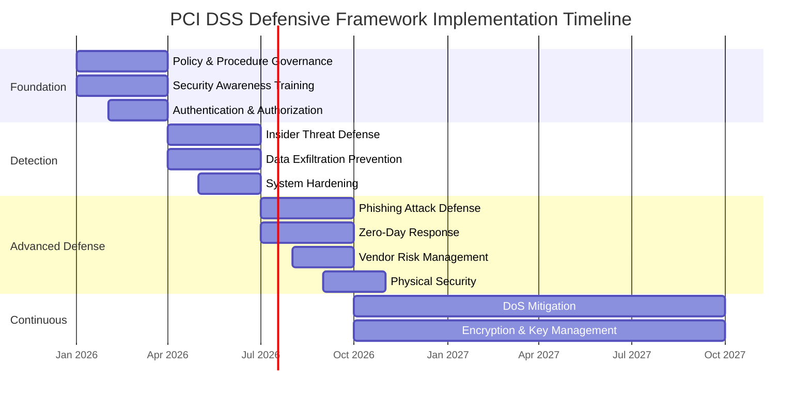

# Closing Summary: Building a Comprehensive Defense with PCI DSS

## Implementation Summary

The defensive framework approach reorganizes PCI DSS v4.0.1 from compliance checklist into strategic security architecture. Understanding which requirements work together to defeat specific attack types enables more effective implementation than sequential requirement-by-requirement compliance.

### Framework Interdependencies

Frameworks reinforce rather than duplicate effort:

**Authentication & Authorization** enables **Insider Threat Defense** through unique IDs that make logging meaningful. Without identity attribution, activity monitoring provides limited value.

**System Hardening** supports **Zero-Day Vulnerability Response** by reducing attack surface. Fewer exposed services mean fewer potential zero-day targets.

**Encryption & Key Management** acts as backstop for **Data Exfiltration Prevention**. When perimeter, access, and monitoring controls fail, encryption renders exfiltrated data unusable.

**Policy & Procedure Governance** and **Security Awareness Training** underpin all technical frameworks. Controls documented in policy and understood by personnel function more effectively than ad hoc implementations.

### Risk-Based Prioritization

Not all organizations face identical threats. Prioritize frameworks based on:

**Industry risk profile**: Retail faces different threats than professional services. E-commerce sites prioritize phishing and DoS defense; payment processors prioritize data exfiltration prevention.

**Attack surface**: Internet-facing systems require stronger perimeter defense. Air-gapped systems can deprioritize network-based threats in favor of insider and physical security.

**Existing control maturity**: Organizations with strong authentication but weak monitoring should prioritize detection frameworks. Those with robust monitoring but weak access controls should focus on authentication and authorization.

**Historical incident patterns**: Organizations breached through specific vectors should prioritize frameworks addressing those attack types.

### Implementation Approach

**Phase 1: Foundation (Months 1-3)**

- Policy & Procedure Governance
- Security Awareness Training (baseline)
- Authentication & Authorization (MFA deployment)

**Phase 2: Detection (Months 3-6)**

- Insider Threat Defense (logging and monitoring)
- Data Exfiltration Prevention (encryption, egress controls)
- System Hardening (configuration baselines)

**Phase 3: Advanced Defense (Months 6-12)**

- Phishing Attack Defense (simulations, technical filtering)
- Zero-Day Vulnerability Response (incident response testing)
- Third-Party Vendor Risk Management (compliance verification)
- Physical Security (enhanced monitoring)

**Continuous Operation**

- DoS Attack Mitigation (ongoing capacity monitoring)
- Encryption & Key Management (key rotation, algorithm updates)

### Measuring Success

Framework effectiveness requires quantifiable metrics:

- **Prevention metrics**: Phishing click rates, unauthorized access attempts, configuration compliance
- **Detection metrics**: Mean time to detect anomalies, logging coverage, alert accuracy
- **Response metrics**: Time to patch critical vulnerabilities, incident response times, access revocation speed
- **Compliance metrics**: Audit findings, control test results, policy review currency

Track metrics continuously rather than point-in-time snapshots. Trends reveal control effectiveness better than absolute values.

### Final Observations

PCI DSS v4.0.1 provides comprehensive security controls when properly implemented. The defensive framework approach ensures that related controls are implemented cohesively, creating layered defense rather than isolated controls.

Security failures typically result from gaps between controls rather than missing individual requirements. Understanding how controls combine to defeat specific attacks enables identification and remediation of gaps before exploitation.

Organizations implementing these frameworks move beyond checkbox compliance to strategic security. Controls serve clear defensive purposes, metrics measure security effectiveness rather than just compliance status, and investment priorities align with actual threat landscape.

The goal is not perfect security—that doesn't exist. The goal is making successful attacks require multiple control failures, increasing difficulty and cost for attackers while improving detection likelihood. Defense in depth through properly layered controls achieves this objective.
