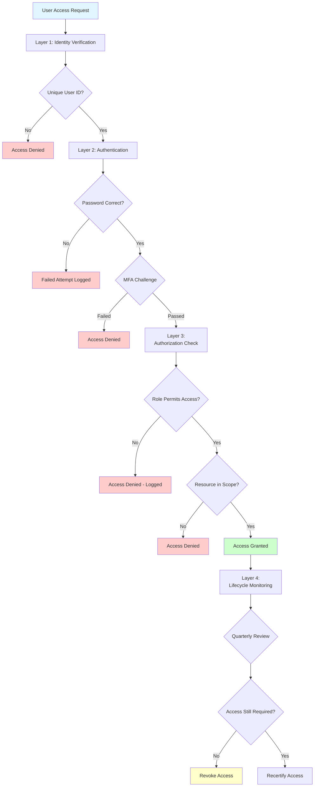

# authentication-authorization.md

# Authentication and Authorization Control Framework: Keeping the Keys to the Castle in the Right Hands

Authentication verifies identity, while authorization controls access to resources. Together, they form the foundation of access control. Weak authentication allows unauthorized access regardless of authorization controls, while improper authorization grants excessive privileges to authenticated users.

## Real-World Authentication Failure

In 2020, Twitter suffered an internal compromise when attackers used social engineering and phone spear-phishing to compromise employee credentials. The attackers gained access to internal tools with powerful administrative capabilities, then used those tools to take over high-profile accounts including Barack Obama, Joe Biden, Elon Musk, and Bill Gates. The compromised accounts posted bitcoin scam messages reaching millions of followers.

The breach succeeded despite Twitter's technical security because authentication relied primarily on passwords without universal MFA enforcement for administrative tools. Social engineering bypassed password security, and lack of additional authentication factors allowed attackers to leverage stolen credentials fully. Stronger authentication requiring hardware tokens or other phishing-resistant factors would have blocked the attack even with compromised passwords.

## Defense Architecture

Authentication and authorization defense assumes that some credentials will be compromised and some users will be malicious. Layered controls detect and limit damage from authentication failures and authorization abuse.

### Layer 1: Identity Management (PCI DSS 8.1.1)

Unique user IDs enable accountability by ensuring every action can be attributed to a specific individual. Shared accounts prevent attribution—when multiple administrators use a generic "admin" account, logs cannot determine who performed specific actions. Individual credentials for all users and administrators create clear accountability trails. Service accounts used by applications require limited scope defining exactly what the service can access, and documented ownership specifying which team maintains the service account. Unique identifiers persist throughout account lifecycle from creation through termination.

Without unique IDs, logging becomes meaningless for accountability purposes. System logs showing "admin user modified firewall rules" provide no investigative value when five administrators share the admin account. Logs showing "jsmith modified firewall rules" enable immediate investigation and accountability.

**Use Case:** A payment processor eliminates all shared accounts across their infrastructure. Database administrators each receive individual accounts with DBA privileges. Application service accounts receive names identifying the application and owner: "payment-gateway-prod-svc owned by payments-team". SSH access requires individual user keys, with shared root access disabled. When suspicious database activity occurs at 2 AM, logs immediately identify the specific DBA account. Investigation reveals credential compromise, enabling targeted response rather than investigating all five DBAs.

### Layer 2: Strong Authentication (PCI DSS 8.2.2, 8.3)

Multi-factor authentication protects against credential compromise through diverse authentication factors. Something you know (password), something you have (hardware token, mobile authenticator app), and something you are (biometric) represent independent factors that cannot be simultaneously compromised through single attack vectors. MFA requirements apply to all non-console administrative access (administrators working remotely or through jump hosts) and all remote access to the cardholder data environment. Strong password requirements including length (minimum 12-15 characters), complexity (mixture of character types), and history (preventing password reuse) provide baseline protection. Time-based one-time passwords or hardware tokens provide stronger protection than SMS-based codes vulnerable to SIM swapping attacks where attackers convince mobile carriers to transfer phone numbers to attacker-controlled devices.

MFA prevents credential stuffing attacks using passwords compromised at other organizations, phishing attacks that harvest passwords, and password reuse where users employ the same password across multiple systems. Even when attackers obtain valid passwords, they cannot authenticate without the second factor.

**Real-World Example:** After the SolarWinds compromise, many organizations reevaluated MFA implementations. They discovered that while MFA was required, many implementations used SMS-based codes vulnerable to interception. Organizations migrated to FIDO2 hardware security keys or mobile authenticator apps using cryptographic challenge-response. When subsequent phishing campaigns targeted their users, attackers obtained passwords but failed authentication because MFA codes generated through authenticator apps cannot be phished—they're time-based and tied to specific domains, preventing reuse on attacker phishing sites.

### Layer 3: Authorization Controls (PCI DSS 7.1.1, 7.2.1)

Role-based access control limits privilege through job-function-appropriate permissions. Access grants require documented business need explaining why the user needs specific access. Principle of least privilege ensures users receive minimum required permissions to perform job functions, not broad access for convenience. Role definitions document which positions require which access, with approval requirements specifying who can authorize access grants. Regular reviews identify and remove excessive permissions that accumulated over time as job responsibilities changed.

Authorization should be additive rather than permissive. Users start with no access and gain only documented, approved permissions. The alternative—granting broad access by default and restricting only sensitive resources—inevitably creates security gaps where sensitive resources aren't properly identified or restrictions aren't consistently applied.

**Use Case:** A merchant services provider implements role-based access control with four tiers: Tier 1 support accesses customer contact information and non-financial account details. Tier 2 support additionally accesses transaction history and basic account modifications. Finance team accesses payment methods and financial data for their assigned accounts only. Engineering team accesses production systems with read-only access, requiring security approval and time-limited elevation for write access. A compromised Tier 1 support account provides minimal value to attackers—no payment data, no system access, limited customer information.

### Layer 4: Access Lifecycle Management (PCI DSS 8.1.4, 8.1.5)

Dynamic access control adapts to changing needs through continuous monitoring and recertification. Immediate revocation upon termination prevents ex-employees from accessing systems after departure. Same-day revocation for role changes ensures employees losing access requirements don't retain unnecessary permissions. Periodic access recertification occurs quarterly for privileged access and annually for standard access, validating that current access matches current job responsibilities. Automated deprovisioning integrated with HR systems ensures termination triggers immediate access revocation across all systems without manual intervention delays.

Access requirements change constantly as employees change roles, projects complete, and business needs evolve. Quarterly reviews identify accounts that should have been terminated, permissions exceeding current roles, and dormant accounts requiring deactivation due to prolonged inactivity.

**Real-World Metrics:** Organizations with manual termination processes average 3-5 days to complete access revocation, with 15-20% of terminated employees retaining partial access beyond 30 days. Automated revocation integrated with HRIS achieves full access removal within 1 hour for 95%+ of terminations. The difference represents significant risk reduction—ex-employees cannot act on grievances, competitors cannot gain intelligence through employees joining rival firms, and stolen credentials from ex-employees become useless immediately.

## Implementation Sequence

1. **Eliminate shared accounts** and establish unique user IDs within 60 days (enable accountability for all actions)
2. **Deploy MFA** for administrative and remote access within 30 days (protect credentials from compromise)
3. **Document role-based access matrix** defining permissions per role within 90 days (establish authorization model)
4. **Implement automated access reviews** and recertification workflows within 120 days (continuous validation)
5. **Integrate access lifecycle** with HR processes within 120 days (automate provisioning and deprovisioning)

## Metrics That Matter

- **Unique account coverage:** Target 100% of users with individual credentials, zero shared accounts
- **MFA coverage:** Target 100% of administrative access and remote CDE access protected by MFA
- **Access recertification completion:** Target 100% completed within certification window with zero overdue reviews
- **Termination-to-revocation time:** Target <1 hour from HR termination event to complete access removal across all systems

## Authentication and Authorization as Defense Layers

Authentication and authorization defense operates under the assumption that some credentials will be compromised through phishing, malware, or insider threats. Perfect prevention is impossible, so defense focuses on limiting the value of compromised credentials through MFA, restricting what authenticated users can access through authorization, and detecting misuse through logging and recertification.

The goal is ensuring that credential compromise alone doesn't result in system compromise, that authenticated access is limited to legitimate business needs, and that access evolves with changing requirements rather than accumulating indefinitely.