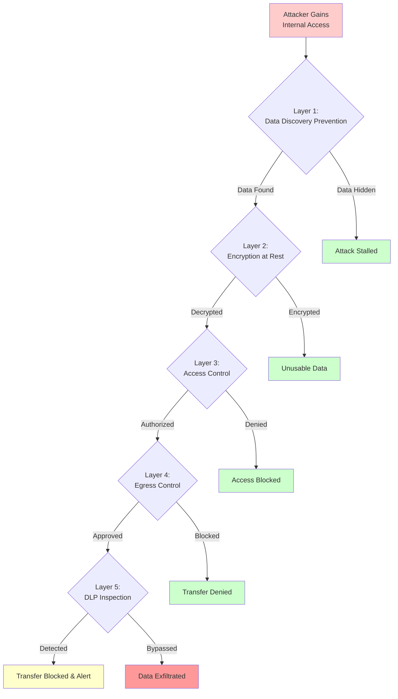

# Data Exfiltration Prevention Framework: Keeping Cardholder Data Where It Belongs

Data exfiltration represents the ultimate security control failure—attackers successfully locate sensitive data, gain access, extract it from the environment, and evade detection during the process. Preventing exfiltration requires defense in depth across multiple control layers, assuming that perimeter defenses will eventually fail and preparing internal controls to contain the breach.

## Real-World Attack Scenario

The 2013 Target breach compromised 40 million payment cards through a multi-stage attack that defeated individual security controls. Attackers gained initial access through a third-party HVAC vendor's compromised credentials, moved laterally through Target's network to point-of-sale systems, installed memory-scraping malware to capture card data, and exfiltrated stolen data to attacker-controlled servers over several weeks.

Each attack stage succeeded because controls operated independently rather than as defense layers. Stolen vendor credentials granted internal network access because third-party connections lacked network segmentation. POS systems became accessible because internal networks lacked micro-segmentation. Malware executed because systems lacked application whitelisting. Data exfiltration proceeded because egress traffic lacked data loss prevention inspection.

The breach revealed that preventing exfiltration requires assuming attackers will gain internal access and preparing multiple defensive layers to detect and contain them before data leaves the environment.

## Defense Architecture

Data exfiltration prevention requires five defensive layers, each designed to catch attacks that bypass previous layers:

### Layer 1: Data Minimization & Discovery Prevention (PCI DSS 3.1, 3.2, 12.10.6)

The most effective exfiltration prevention is having no data to steal. Retention and disposal policies ensure organizations store cardholder data only as long as business and legal requirements mandate. After retention periods expire, secure deletion renders data irrecoverable—not just deleted from file systems but overwritten to prevent forensic recovery.

Automated discovery scans identify where cardholder data exists across the environment. Many breaches exfiltrate data from systems organizations didn't know contained sensitive information—development databases with production data copies, archived log files capturing full card numbers, backup systems retaining data past disposal dates. Regular scans catalog data locations, triggering remediation workflows when data appears in unauthorized locations.

Data loss prevention systems monitor for sensitive data patterns in unexpected places. When full card numbers appear in email messages, document shares, or developer workstations, automated controls block the activity and alert security teams. This prevents accidental exposure through well-meaning but policy-violating employee actions like emailing transaction reports containing full card numbers.

**Use Case:** A payment processor implements automated data discovery scanning across all file systems, databases, and backups monthly. Scans identify archived customer service chat logs from 2019 containing full card numbers during payment troubleshooting. The data exceeded the 90-day retention policy by three years. Automated workflows flag the violation, create deletion tickets assigned to storage administrators, and verify secure deletion within 48 hours. Without automated discovery, the forgotten archive would have remained indefinitely, expanding the attack surface with every passing year.

### Layer 2: Strong Cryptography (PCI DSS 3.5, 3.6, 3.7)

Encryption at rest ensures that stolen data remains unusable without corresponding decryption keys. Even when attackers gain file system access and exfiltrate database files, encrypted data forces a second attack stage—key compromise. Strong cryptography uses industry-accepted algorithms (AES-256, RSA 2048-bit or higher) with proper implementation avoiding common pitfalls like weak key generation, hardcoded keys, or keys stored alongside encrypted data.

Key management determines encryption effectiveness. Keys stored in environment variables or configuration files provide minimal protection—attackers with file access obtain both encrypted data and keys simultaneously. Hardware security modules (HSMs) or cloud key management services with strong access controls separate key access from data access, requiring attackers to compromise multiple systems independently.

Key rotation limits damage from key compromise. Regular rotation ensures that stolen keys provide access only to recently encrypted data, not the complete historical dataset. Automated rotation with secure key destruction eliminates human error and ensures consistent protection across all encrypted data stores.

**Real-World Example:** Adobe's 2013 breach exposed 38 million encrypted passwords, but attackers also obtained the encryption key from Adobe's network, rendering encryption ineffective. The breach demonstrated that encryption protects only when key management isolates keys from data. Organizations must assume attackers who compromise data storage can also compromise nearby keys and design key management accordingly.

### Layer 3: Strict Access Control (PCI DSS 7.1, 7.2, 8.2)

Least privilege and strong authentication ensure that even internal users cannot access cardholder data without business justification. Role-based access limits data access to job functions requiring it—customer service representatives query individual customer accounts during support interactions, finance teams access aggregated reporting data, developers access masked data in non-production environments.

Multi-factor authentication on all administrative access and cardholder data access prevents credential compromise from granting immediate data access. Stolen usernames and passwords cannot authenticate without time-based tokens, hardware keys, or biometric verification. This transforms credential theft from immediate breach into failed authentication attempt.

Just-in-time access provides temporary elevated permissions for specific tasks, then automatically revokes access when the task completes. Database administrators receive production access for scheduled maintenance windows, developers receive debugging access for specific incidents, with automatic revocation after time limits expire. This minimizes the window during which compromised credentials grant elevated access.

**Use Case:** A payment gateway provider implements just-in-time access for production database administration. DBAs request access through an approval workflow specifying the required change and time window. After manager approval, the system grants database access for the specified duration (typically 1-4 hours for maintenance windows). Access automatically revokes when the time expires or when the DBA manually releases access after completing work. This approach reduces the standing privileged access population from 12 DBAs with permanent access to 0 permanent access with temporary grants only when needed.

### Layer 4: Network Segmentation & Egress Control (PCI DSS 1.2, 1.3, 1.4)

Network segmentation contains compromised systems, preventing lateral movement toward sensitive data. The cardholder data environment resides in isolated network segments with firewall rules denying unauthorized traffic. Attackers who compromise systems outside the CDE cannot directly access payment systems, forcing them to chain multiple exploits across network boundaries.

Egress filtering restricts outbound connections from the CDE to known-good destinations—payment processor APIs, update servers, monitoring systems. When compromised systems attempt connections to attacker-controlled servers, egress controls block the traffic. Default-deny egress rules with explicit allow-listing create significant barriers to exfiltration.

Proxy-based egress with TLS inspection examines encrypted outbound traffic for sensitive data patterns. Attackers cannot bypass inspection through encryption because proxy servers decrypt, inspect, and re-encrypt all outbound traffic. This prevents common exfiltration techniques like DNS tunneling or HTTPS uploads to file-sharing services.

**Real-World Metrics:** Organizations with mature network segmentation and egress control typically detect and contain breaches weeks or months earlier than those without. The 2013 Target breach exfiltrated data over three weeks through unmonitored outbound connections. Modern egress controls would have flagged the unusual outbound traffic patterns within hours.

### Layer 5: Data Loss Prevention (PCI DSS 10.2, 10.6)

DLP systems monitor network traffic, endpoints, and storage for cardholder data patterns. Pattern matching identifies full card numbers (PANs) using Luhn algorithm validation, CVV patterns, and cardholder name combinations. When DLP detects sensitive data in policy-violating contexts—email attachments, USB transfers, cloud storage uploads—automated responses block the activity and alert security teams.

Content inspection extends beyond simple pattern matching to contextual analysis. False positives plague DLP systems because card number patterns appear in legitimate contexts like test data or public documentation. Machine learning-based DLP reduces false positives by understanding context—real cardholder data appears with matching names, addresses, and transaction details, while test data uses obviously fake patterns ("4111111111111111") or lacks realistic context.

Endpoint DLP monitors workstations and servers for local data storage violations. When developers download production databases to local machines for troubleshooting or analysts export transaction reports to USB drives, endpoint DLP enforces policy—blocking prohibited transfers, encrypting authorized transfers, or requiring approval workflows for sensitive data movement.

**Use Case:** A payment processor deploys endpoint and network DLP across all systems with cardholder data access. A financial analyst attempts to email a customer transaction report containing 500 full card numbers to personal Gmail for after-hours work. Network DLP detects the card patterns in outbound SMTP traffic, blocks the email, and alerts the security team. Investigation reveals no malicious intent—the analyst thought working from home would help meet a deadline—but the blocked exfiltration prevents accidental exposure. The analyst receives immediate training on proper data handling, and the incident drives broader awareness training.

## Implementation Sequence

1. **Deploy automated data discovery** and establish baseline of where cardholder data exists within 30 days (foundational visibility)
2. **Implement encryption at rest** with HSM-based key management within 60 days (immediate data protection)
3. **Enforce network segmentation** isolating cardholder data environment within 60 days (contain potential breaches)
4. **Deploy egress filtering** with default-deny and allow-listing within 90 days (prevent unmonitored exfiltration)
5. **Implement DLP** on network and endpoints with pattern matching and behavioral analysis within 120 days (final detection layer)

## Metrics That Matter

- **Data discovery scan coverage:** Percentage of systems scanned monthly (target 100% of in-scope environment)
- **Encryption coverage:** Percentage of stored cardholder data encrypted (target 100%)
- **Unauthorized access attempt rate:** Failed access attempts to restricted data per 1000 user sessions (establish baseline, monitor trends)
- **Egress policy violation rate:** Blocked outbound connections from CDE per day (establish baseline, investigate anomalies)
- **DLP detection accuracy:** True positive rate and false positive rate (target >90% true positive, <10% false positive)

## Why Assume-Breach Mentality Works

Exfiltration prevention succeeds when organizations assume perimeter defenses will eventually fail and prepare layered internal controls. Each defensive layer introduces additional complexity for attackers—they must discover data, decrypt it, gain access, circumvent network controls, and evade DLP, requiring multiple simultaneous control failures for successful exfiltration.

The Target breach succeeded because controls operated independently. Modern exfiltration prevention ensures that compromising vendor credentials doesn't grant access to payment systems, accessing payment systems doesn't provide plaintext card data, obtaining card data doesn't enable network exfiltration, and any exfiltration attempt triggers immediate detection and response. The goal is not preventing initial compromise—that's often inevitable—but ensuring that initial access cannot escalate to full breach without detection.
