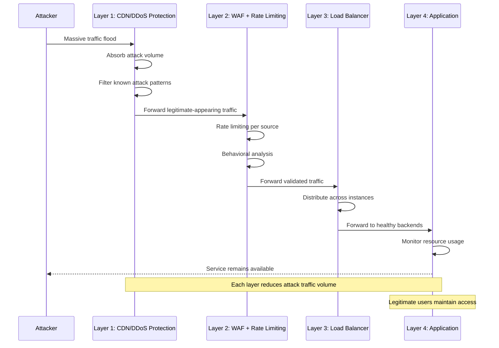

# DoS Attack Mitigation Framework: Keeping Services Available Under Fire

Denial-of-service attacks aim to exhaust system resources—network bandwidth, CPU capacity, memory, or application connection pools—rendering services unavailable to legitimate users. Unlike data theft attacks, DoS succeeds not by stealing information but by preventing business operations. For payment processing systems, unavailability directly translates to lost revenue and customer trust.

## Real-World Attack Scenario

In October 2016, the Mirai botnet launched a massive distributed denial-of-service attack against Dyn, a major DNS provider. The attack peaked at 1.2 terabits per second, using hundreds of thousands of compromised IoT devices—security cameras, DVRs, routers—to flood Dyn's infrastructure with malicious traffic. The attack rendered major websites unreachable for hours, including payment processors and e-commerce platforms.

The attack succeeded because defense focused on attack traffic filtering rather than capacity planning and distributed architecture. Single-point DNS infrastructure became a single point of failure. When traffic volume overwhelmed filtering capacity, legitimate traffic couldn't reach services even though the services themselves remained operational.

## Defense Architecture

DoS mitigation requires four defensive layers working together to absorb, filter, and maintain service during attacks:

### Layer 1: Traffic Monitoring & Anomaly Detection (PCI DSS 10.6, 11.5.1)

Continuous monitoring establishes baseline traffic patterns—typical request volumes, geographic distribution, user agent patterns, and protocol distributions. Anomaly detection flags deviations from baselines: sudden traffic spikes from unusual geographic regions, abnormal request patterns like repeated requests for the same resource, or unusual protocol distributions.

Security information and event management systems correlate traffic patterns with threat intelligence. When traffic surges coincide with known botnet activity or match attack signatures from recent campaigns against other targets, automated alerting triggers investigation and defensive posture changes.

Early detection enables proactive defense. Attacks typically begin with reconnaissance—probing for vulnerable endpoints, testing rate limits, mapping infrastructure. Detecting and responding to reconnaissance prevents attackers from optimizing their attack strategy.

**Use Case:** A payment gateway monitors API request patterns across all endpoints. Baseline traffic shows consistent geographic distribution: 60% North America, 30% Europe, 10% Asia-Pacific. Monitoring detects sudden traffic surge from Eastern Europe—from typical 2% to 40% of total traffic within 10 minutes. Traffic consists of valid-looking API requests to authentication endpoints. Security team activates enhanced rate limiting and WAF rules while investigating the source. Attack turns out to be credential stuffing attempt using compromised credentials from third-party breaches. Early detection prevents account takeovers and enables proactive customer notification.

### Layer 2: Traffic Filtering & Rate Limiting (PCI DSS 1.2.1, 6.4.2)

Network security controls filter malicious traffic before it reaches application infrastructure. Techniques include:

- **IP reputation filtering:** Block traffic from known malicious sources—botnets, tor exit nodes, anonymous proxies
- **Geographic filtering:** Restrict traffic to expected regions when business doesn't require global access
- **Protocol validation:** Enforce proper protocol usage, rejecting malformed requests
- **Rate limiting:** Restrict request volumes per source IP, user account, or API key
- **Connection limiting:** Cap concurrent connections per source to prevent connection pool exhaustion

Web application firewalls apply advanced filtering based on request content and behavior patterns. WAFs detect attack signatures—SQL injection attempts, cross-site scripting, and application-layer DoS patterns like Slowloris attacks that maintain many slow connections to exhaust server resources.

Rate limiting requires careful tuning to balance attack mitigation against legitimate traffic. Too restrictive and legitimate users face service degradation during traffic spikes. Too permissive and attacks proceed unchecked. Adaptive rate limiting adjusts thresholds based on current system capacity and detected threat levels.

**Real-World Example:** In 2018, GitHub successfully defended against the largest recorded DDoS attack at the time—1.35 terabits per second using memcached amplification. GitHub's defense relied on massive upstream filtering capacity from their DDoS protection provider. The attack lasted less than 20 minutes because filtering infrastructure absorbed the volume without overwhelming GitHub's application infrastructure. Without upstream filtering, the attack would have exhausted GitHub's network capacity regardless of application resilience.

### Layer 3: Capacity Planning & Scalability (PCI DSS 12.1, 12.9)

Adequate capacity ensures systems withstand both legitimate traffic spikes and moderate attacks. Capacity planning considers:

- **Peak legitimate traffic:** Black Friday e-commerce, tax deadline payment processing, payroll processing dates
- **Growth projections:** Expected traffic increases from business growth
- **Attack margin:** Additional capacity to absorb attacks while serving legitimate users
- **Geographic distribution:** Multi-region deployment prevents single-region attacks from causing global outages

Auto-scaling dynamically adds capacity during traffic surges. When request volumes exceed thresholds, orchestration systems automatically deploy additional application instances, distribute traffic across the expanded fleet, and scale back down when traffic normalizes. This provides cost-effective capacity that expands during attacks without maintaining permanent excess capacity.

Content delivery networks distribute static content geographically, reducing load on origin servers and providing distributed capacity that attackers must overcome. CDNs absorb attacks by distributing the traffic across global infrastructure rather than concentrating it against a single origin.

**Use Case:** A subscription billing platform processes monthly recurring payments for 2 million customers. Normal traffic averages 500 requests/second with monthly peaks at 2,000 requests/second during billing cycle processing. They provision baseline capacity for 3,000 requests/second and implement auto-scaling to 10,000 requests/second. During a 2020 DDoS attack, malicious traffic reached 15,000 requests/second. CDN and WAF filtering reduced malicious traffic to 4,000 requests/second reaching application infrastructure. Auto-scaling expanded capacity to 8,000 requests/second, absorbing the filtered attack traffic while maintaining service for legitimate users. Without both filtering and auto-scaling, the attack would have succeeded.

### Layer 4: Resilient Architecture (PCI DSS 2.2, 12.9)

System hardening and architectural resilience ensure that individual component failures don't cascade into complete service outages. Resilient architectures incorporate:

- **Load balancing:** Distribute traffic across multiple application instances
- **Health checking:** Automatically remove failed instances from rotation
- **Circuit breakers:** Stop cascading failures by failing fast when dependencies are unhealthy
- **Graceful degradation:** Maintain core functionality when non-essential services fail
- **Multi-region deployment:** Continue service from healthy regions when one region is under attack

Database and storage systems implement replication and failover. When primary databases become unavailable—due to attack or infrastructure failure—automatic failover promotes replicas to primary role, maintaining data availability. Read replicas distribute query load, preventing database exhaustion during high-volume attacks.

Message queues buffer requests during traffic spikes, preventing overwhelming backend services. When traffic exceeds processing capacity, queues accept requests and process them at sustainable rates. This transforms real-time overload into delayed processing rather than failed requests.

**Real-World Metrics:** Organizations with mature DoS defenses typically maintain >99.9% availability during attacks that would completely disable unprepared systems. The key metric is not preventing attacks—attackers will attack regardless—but maintaining service availability for legitimate users throughout the attack.

## Implementation Sequence

1. **Establish traffic monitoring and baseline** normal patterns within 30 days (visibility foundation)
2. **Implement basic rate limiting** on all public endpoints within 30 days (immediate attack mitigation)
3. **Deploy CDN and DDoS protection** with upstream filtering within 60 days (absorb volumetric attacks)
4. **Implement auto-scaling** for application tier within 90 days (dynamic capacity expansion)
5. **Deploy multi-region architecture** for critical services within 180 days (geographic resilience)

## Metrics That Matter

- **Traffic baseline accuracy:** Percentage of false positive anomaly alerts (target <5% through continuous tuning)
- **Attack detection latency:** Time from attack start to detection (target <5 minutes for volumetric attacks)
- **Attack mitigation effectiveness:** Percentage of attack traffic filtered before reaching application (target >95%)
- **Service availability during attacks:** Uptime percentage during confirmed attacks (target >99.9%)
- **Legitimate user impact:** False positive rate where legitimate users are blocked (target <0.1%)

## Why Layered Defense Works

DoS mitigation succeeds when no single attack vector can exhaust all defensive layers simultaneously. Volumetric attacks overwhelm network capacity but get absorbed by CDN infrastructure. Application-layer attacks bypass volumetric defenses but get caught by WAF behavioral analysis. Sophisticated attacks that mimic legitimate traffic get rate-limited before exhausting application resources. Attacks that penetrate all filtering face auto-scaled infrastructure with excess capacity.

The goal is not preventing all malicious traffic from reaching infrastructure—perfect filtering is impossible without blocking legitimate users. The goal is ensuring that the malicious traffic that does reach application infrastructure gets absorbed by excess capacity and architectural resilience, maintaining availability for legitimate users throughout the attack.

Organizations that implement layered DoS defense don't eliminate attacks, but they transform attacks from business-disrupting incidents into detected security events that don't affect customer experience.
