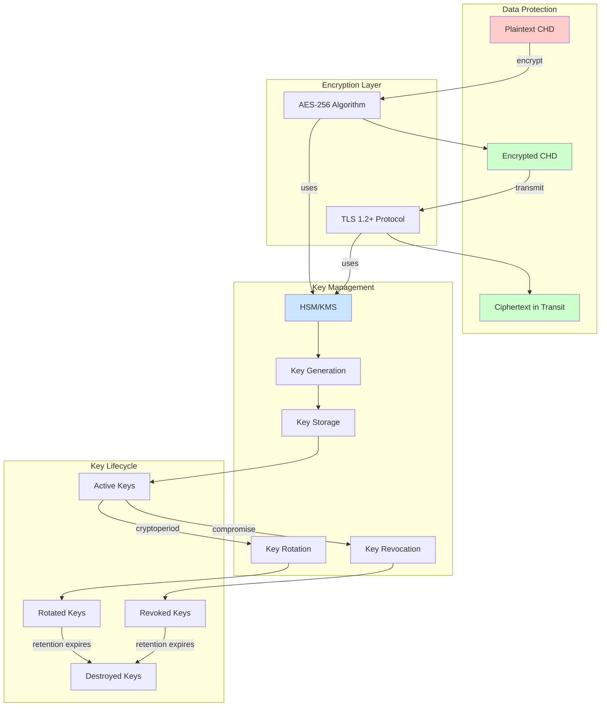

# Encryption and Key Management Framework: Making Sure Stolen Data Is Useless

Encryption transforms plaintext data into ciphertext unusable without decryption keys. It provides the last line of defense—even when perimeter, access, and monitoring controls fail, encrypted data remains protected. However, encryption effectiveness depends entirely on key management.

## Real-World Encryption Failures

In 2009, Heartland Payment Systems suffered a breach exposing 130 million payment cards. Attackers installed malware on payment processing systems, capturing card data in memory before encryption occurred. The breach succeeded because while data was encrypted at rest and in transit, it existed in cleartext during processing. In contrast, when encrypted backup tapes are lost or stolen, as has occurred with numerous organizations, properly encrypted data remains protected. The difference: encryption protects data when applied comprehensively, not selectively.

The TJX breach in 2007 exposed 94 million payment cards partly because the organization used WEP encryption for wireless networks—a deprecated, easily cracked protocol. Attackers broke the weak encryption in minutes. The breach demonstrated that encryption alone provides insufficient protection; strong cryptography and proper key management determine whether encryption actually protects data.

## Defense Architecture

Encryption defense assumes that data will be accessed by unauthorized parties. The goal is ensuring accessed data remains unusable through strong cryptography and secure key management.

### Layer 1: Data-at-Rest Encryption (PCI DSS 3.4)

Strong cryptography protects stored cardholder data through encryption algorithms proven resistant to cryptanalysis. AES-256 provides industry-standard symmetric encryption suitable for bulk data protection. Full-disk encryption protects laptops and portable media against theft—stolen devices contain encrypted data unusable without decryption keys. Database-level encryption or application-level encryption protects structured data, ensuring database dumps or stolen database files contain ciphertext. Encrypted backups and archives prevent data exposure from backup media theft or improper disposal.

Encryption must render data unreadable through cryptographic mechanisms, not obfuscation. Truncation (storing only last four digits), masking (displaying asterisks instead of digits), or hashing serve different purposes but are not encryption. Only cryptographic algorithms using secret keys qualify as encryption under PCI DSS.

**Use Case:** A payment gateway implements application-level encryption for all stored cardholder data. The application encrypts credit card numbers before database insertion using AES-256. Decryption keys reside in a dedicated key management service, not in application configuration files or database systems. Database administrators performing maintenance see encrypted ciphertext only. Application developers debugging issues see encrypted data. Only the payment processing application accessing the KMS can decrypt cardholder data, and only when business logic determines decryption is necessary for transaction processing.

### Layer 2: Data-in-Transit Protection (PCI DSS 4.1, 4.1.1)

TLS protects data during transmission across networks. TLS 1.2 or higher with strong cipher suites prevents eavesdropping on network communications. Weak ciphers including null encryption (no encryption), export-grade ciphers (intentionally weakened), and deprecated algorithms like RC4 or DES must be disabled. Certificate validation ensures communication authenticity through proper trust chain verification preventing man-in-the-middle attacks. Perfect forward secrecy generates unique session keys ensuring that compromise of long-term private keys cannot enable retrospective decryption of captured traffic.

Transmission security extends beyond HTTPS for customer-facing websites. Encrypted channels must protect data in transit between internal systems, communications to payment processors, and data flowing across any untrusted networks including internal networks where other applications operate.

**Real-World Example:** A merchant services provider reviews their TLS configuration and discovers legacy systems using TLS 1.0 with weak cipher suites for backward compatibility with older point-of-sale devices. Security assessment identifies the risk. They establish a 180-day migration timeline: Months 1-2 inventory affected POS devices, Months 3-4 coordinate upgrades with merchants, Months 5-6 complete device updates and disable weak protocols. Post-migration verification confirms all connections use TLS 1.2+ with strong cipher suites. Legacy protocol removal eliminates a significant vulnerability.

### Layer 3: Key Generation & Storage (PCI DSS 3.5, 3.6)

Secure key management protects encryption effectiveness. Encryption keys represent single points of failure—compromise of keys negates all encryption protection. Strong random key generation uses cryptographic random number generators, not predictable pseudo-random generators. Hardware security modules provide tamper-resistant key storage with access controls preventing unauthorized key extraction. Cloud-based key management services offer similar protections through dedicated key storage infrastructure. Keys must be stored separately from encrypted data—storing keys in the same database or file system as encrypted data provides no protection when attackers gain system access.

Key access requires restriction to minimal necessary personnel and systems. Applications needing encryption keys should use them through secure APIs without direct key access. Administrators should never have direct key access—automated systems manage key lifecycle.

**Use Case:** A payment processor migrates encryption keys from file-based storage to a hardware security module. Previously, keys resided in configuration files protected through file permissions and encrypted volumes—better than plaintext but vulnerable to root access or stolen backups. Post-migration, keys reside exclusively in HSM with cryptographic access controls. Applications make encryption/decryption requests to HSM APIs without receiving actual key material. Even root-level system compromise cannot extract keys from HSM. Theft of encrypted database backups provides no value without HSM access.

### Layer 4: Key Lifecycle Management (PCI DSS 3.6.4, 3.6.6)

Regular key rotation limits exposure from compromise. Cryptoperiod defines how long keys remain active before rotation, based on risk assessment considering sensitivity of encrypted data, expected attack time against the algorithm, and operational complexity of rotation. Automated key rotation where possible reduces operational burden and ensures consistent execution according to schedule. Immediate key revocation must occur upon suspected compromise or departure of personnel with key access. Secure key destruction procedures ensure retired keys cannot be recovered and used to decrypt archived data after retention periods expire.

Key rotation creates operational complexity but limits the window of vulnerability if keys are compromised. A key used for three years potentially exposes three years of encrypted data if compromised. A key rotated quarterly limits exposure to three months of data.

**Real-World Metrics:** Organizations with mature key management typically rotate encryption keys annually for production systems with quarterly rotation for high-sensitivity data. Emergency rotation procedures enable key replacement within 24-48 hours upon suspected compromise. Automated rotation reduces average rotation time from 4-6 hours of manual work to 15-30 minutes of automated execution.

## Implementation Sequence

1. **Discover and classify** all cardholder data requiring encryption within 60 days (establish complete scope)
2. **Implement encryption** for data at rest using AES-256 or equivalent within 90 days (protect stored data)
3. **Enforce TLS 1.2+** for all cardholder data transmission within 60 days (protect data in transit)
4. **Establish secure key storage** using HSM or KMS within 120 days (protect keys from compromise)
5. **Implement key rotation** and lifecycle procedures within 90 days (limit exposure window from key compromise)

## Metrics That Matter

- **Encryption coverage:** Target 100% of stored cardholder data encrypted with no exceptions unless documented compensating controls approved
- **TLS configuration compliance:** Target 100% strong cipher suites, zero weak protocols or deprecated algorithms
- **Key storage security:** Target 100% of keys in HSM/KMS with zero keys in file systems or databases
- **Key rotation compliance:** Target 100% rotation within defined cryptoperiods with automated verification

## Encryption as Last Defense Layer

Encryption operates as the last defensive layer. When attackers defeat perimeter controls, bypass authentication, escalate privileges, and exfiltrate data, encryption determines whether the breach results in data exposure. Strong encryption with proper key management transforms data exfiltration from breach notification event into operational incident with limited actual data exposure.

The goal is ensuring that successful attack against systems does not result in successful attack against data. Encryption creates separation between system compromise and data compromise, but only when cryptography is strong and keys are managed securely.
