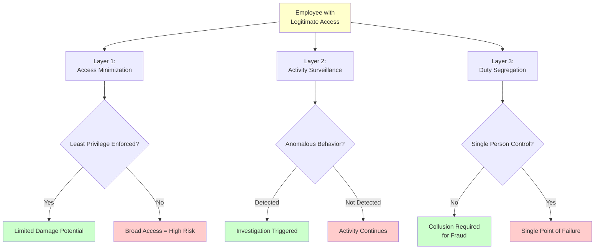

# Insider Threat Defense Framework: When the Call Comes from Inside the House

Insider threats present unique challenges because attackers operate with legitimate credentials and authorized access. Technical perimeter defenses designed to keep outsiders out prove ineffective against users who are already inside. Defense requires visibility into normal behavior patterns, strict access controls that limit damage potential, and monitoring that detects abuse of legitimate privileges.

## Real-World Attack Scenario

In 2018, a Tesla production technician sabotaged the manufacturing operating system after being passed over for promotion. The employee had authorized access to industrial control systems and used that access to modify code, exfiltrate confidential data, and share false information with media outlets. The attack succeeded because the employee's credentials granted broad access without monitoring for unusual activity patterns.

Tesla detected the sabotage through manufacturing anomalies rather than security controls—production metrics showed unexpected behavior before security teams identified the root cause. The incident revealed that authorized access without behavioral monitoring creates blind spots where malicious activity looks identical to legitimate work.

## Defense Architecture

Insider threat defense requires three concurrent control layers, each addressing different attack vectors:

### Layer 1: Access Minimization (PCI DSS 7.1, 7.2)

Least privilege and role-based access control limit damage potential. Users receive only the minimum access required for their job function—customer service representatives access customer accounts but not payment processing configuration, developers access development environments but not production cardholder data, finance personnel access reporting systems but not underlying database infrastructure.

Effective implementation requires access request and approval workflows with automatic provisioning. When a developer joins the payments team, their access request specifies required resources. A manager approves business justification, and systems automatically grant corresponding technical permissions—source code repositories, development database access, and testing environments. Production access remains restricted to operations teams, preventing developers from accessing live cardholder data even accidentally.

Access reviews verify that permissions remain appropriate as roles change. Quarterly reviews compare current access against current job functions, identifying and removing orphaned permissions from previous roles. Automated systems flag high-risk permissions—production database admin, payment gateway configuration, encryption key access—for enhanced review frequency.

**Use Case:** A SaaS payment processor implements role-based access with automated quarterly reviews. When a customer support lead transitions to product management, the review process identifies payment processing admin permissions no longer required for the new role. System automatically revokes the permissions, notifies the user, and requires explicit re-approval if future job duties change. This automation prevents permission accumulation where users retain growing access lists across multiple role changes.

### Layer 2: Activity Surveillance (PCI DSS 10.2, 10.3, 10.6)

Logging and monitoring detect misuse of legitimate access. Comprehensive audit trails capture who accessed what data, when access occurred, what actions were taken, and from which systems. User behavior analytics establish baselines for normal activity patterns—typical login times, accessed resources, query volumes, and data export patterns.

Anomaly detection flags deviations from established baselines: a customer service representative suddenly downloading entire customer databases signals potential data theft, database administrators accessing systems at 3 AM outside their normal schedule warrants investigation, users accessing resources outside their normal scope triggers alerts. Geography-based anomalies—impossible travel where a user appears in California and Romania within an hour—indicate credential sharing or compromise.

Alert thresholds balance detection sensitivity against false positive rates. Too sensitive and security teams drown in alerts, missing genuine threats in the noise. Too loose and insider attacks proceed undetected. Machine learning-based systems continuously refine thresholds based on investigation outcomes, reducing false positives while maintaining detection effectiveness.

**Real-World Example:** In 2019, a Capital One engineer exploited a misconfigured web application firewall to access customer data from AWS cloud infrastructure. The attack succeeded because security monitoring focused on external threats rather than insider activity. Post-breach analysis revealed that comprehensive logging was in place but alert rules didn't flag unusual data access patterns from authorized cloud infrastructure accounts. The breach exposed 100 million customer records because activity monitoring failed to detect abuse of legitimate cloud access.

### Layer 3: Duty Segregation (PCI DSS 6.4.2, 6.5.5, 10.5)

Separation of duties prevents any single person from controlling critical processes end-to-end. Code deployment requires separate individuals for development, review, and deployment—preventing developers from deploying malicious code without oversight. Financial transactions require separate authorization and execution—preventing a single individual from both requesting and approving fraudulent payments. Audit log access separates from system administration—preventing administrators from modifying logs to hide malicious activity.

Effective segregation identifies high-risk combinations where single-person control enables fraud. In payment processing environments, these combinations include: ability to modify payment amounts and approve transactions, access to encryption keys and encrypted data, ability to create user accounts and approve access requests, ability to modify audit logs and perform administrative actions.

Small organizations face challenges implementing strict segregation with limited staff. Compensating controls provide risk mitigation when segregation is impractical—enhanced monitoring of combined privileges, mandatory vacation policies that force temporary handoffs exposing ongoing fraud, and independent third-party reviews of high-risk transactions.

**Use Case:** A small e-commerce company with five employees cannot fully segregate payment processing roles. They implement compensating controls: all payment configuration changes require review by two people with documented approval before implementation, the CEO receives automated daily reports of all payment transactions above $1,000, quarterly independent security assessments review payment system configurations and transaction logs. These controls don't prevent fraud as effectively as full segregation but significantly raise the difficulty and detection probability of insider attacks.

## Implementation Sequence

1. **Document current access patterns** and establish role definitions within 30 days (baseline for least privilege implementation)
2. **Implement role-based access control** with automated provisioning for new users within 60 days (immediate access minimization)
3. **Deploy user behavior analytics** with baseline learning period within 90 days (begin establishing normal activity patterns)
4. **Establish quarterly access reviews** with automated flagging of high-risk permissions ongoing (prevent permission accumulation)
5. **Implement duty segregation** for critical processes starting with highest-risk combinations within 120 days (prevent single-person control of sensitive operations)

## Metrics That Matter

- **Privileged access population:** Percentage of users with administrative or elevated permissions (target <5% of total users)
- **Access review completion rate:** Percentage of users reviewed within required timeframe (target 100% quarterly)
- **Access revocation latency:** Time from role change to permission removal (target <24 hours automated, <7 days manual)
- **Behavioral anomaly investigation rate:** Percentage of anomaly alerts investigated within SLA (target >95% within 24 hours)
- **Alert false positive rate:** Establish baseline and trend toward <10% over 6 months through continuous tuning

## Why Layered Defense Works

Insider threat defense succeeds by making malicious activity increasingly difficult to execute undetected. Access minimization limits what insiders can do, activity surveillance detects when they misuse their legitimate access, and duty segregation prevents single individuals from executing high-impact attacks without collusion.

No single control prevents all insider threats—determined insiders with legitimate access will find ways to abuse their privileges. However, layered controls increase attack complexity and detection probability. An insider must simultaneously circumvent access restrictions, evade behavioral monitoring, and overcome segregation controls, creating multiple opportunities for detection before significant damage occurs.
