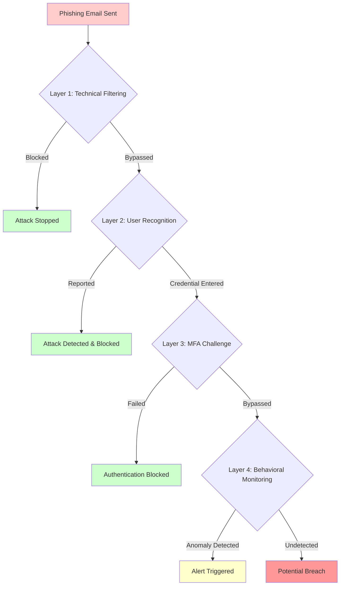

# Phishing Attack Defense Framework: Shield Your Business from One of the Oldest Tricks in the Book

Phishing remains effective because it targets human decision-making rather than technical vulnerabilities. A well-crafted phishing email bypasses perimeter defenses by arriving through legitimate channels and triggers actions that grant attackers initial access.

## Real-World Attack Scenario

In 2019, Barbara Corcoran's real estate firm lost nearly $400,000 to a business email compromise attack. The attacker sent an email that appeared to come from her assistant, requesting payment for a renovation project. The email address was off by a single character—easy to miss during a busy workday. Finance approved the wire transfer within hours.

This attack succeeded despite technical security controls because it exploited human trust and routine business processes. The defense required multiple control layers working together, not just email filtering or awareness training alone.

## Defense Architecture

Phishing defense requires four control layers working in cascade. Each layer catches attacks the previous layer missed:

### Layer 1: Awareness & Recognition (PCI DSS 12.6.1, 12.6.2)

Personnel training addresses the human attack surface. Effective programs teach people to recognize phishing through visual indicators—sender address anomalies like extra characters or lookalike domains, urgent language designed to bypass critical thinking, and suspicious links that don't match their claimed destinations. Training must cover organization-specific scenarios because attackers research their targets. Finance personnel face business email compromise attacks requesting wire transfers, while IT staff encounter fake vendor security alerts and urgent patch requests.

Training effectiveness depends on regular reinforcement through simulated attacks. Monthly phishing simulations expose personnel to realistic scenarios without real consequences, creating muscle memory for threat recognition. When someone clicks a simulated phishing link, immediate training intervention explains what they missed and how to recognize similar attacks. Over time, click rates decline as recognition improves.

**Use Case:** A healthcare payment processor trains billing staff on phishing indicators specific to medical claims processing. Simulated attacks mimic insurance company requests for patient data updates, using realistic logos and claim reference numbers. Staff learn to verify requests through independent channels—calling known phone numbers rather than responding to email addresses. After six months, their phishing click rate drops from 22% to 3%.

### Layer 2: Credential Protection (PCI DSS 8.2.2, 8.3)

Multi-factor authentication creates resilience when credentials are compromised. Even when a user enters their username and password into a convincing phishing site, attackers cannot authenticate without the second factor—a time-based code, hardware token, or biometric verification. MFA transforms credential theft from system compromise into failed authentication attempt.

Implementation must cover all non-console administrative access and remote access to the cardholder data environment. Time-based one-time passwords or hardware tokens provide stronger protection than SMS-based codes, which remain vulnerable to SIM swapping attacks where attackers convince mobile carriers to transfer phone numbers to attacker-controlled devices.

**Real-World Example:** In 2018, attackers compromised Reddit through SMS-based MFA. They intercepted SMS codes through a compromised mobile carrier employee, gaining access to internal systems and source code. The attack succeeded because SMS represented a single point of failure. Reddit subsequently moved to token-based MFA, which cannot be intercepted through telecommunications infrastructure.

### Layer 3: Behavioral Monitoring (PCI DSS 10.2, 10.6)

Logging and daily log review detect post-compromise activity. Phishing attacks often precede authentication attempts from unusual geographic locations—a user in California suddenly authenticating from Romania signals credential compromise. Access to resources outside normal user patterns triggers investigation. A customer service representative suddenly querying payment gateway configuration files indicates unauthorized access or account takeover.

Automated alerting on anomalous authentication patterns reduces detection time from days to minutes. Security information and event management systems correlate multiple signals: impossible travel (authentication from New York followed by London authentication 30 minutes later), unusual access times (3 AM logins from day-shift employees), and privilege escalation attempts.

**Use Case:** A payment processor's security operations center receives an alert when a developer account authenticates from Moldova at 2 AM EST, then attempts to access production database credentials. The system automatically locks the account and notifies the security team. Investigation reveals phishing compromise—the developer clicked a link in a fake GitHub security notice. Because MFA was enforced and behavioral monitoring detected the anomaly, the attacker never accessed production systems. Total detection-to-containment time: 4 minutes.

### Layer 4: Technical Filtering (PCI DSS 1.2.1, 5.2.1)

Network security controls and anti-malware solutions block phishing before user interaction. Email filtering removes messages with known malicious indicators—sender reputation, domain age, content analysis, and known threat signatures. DNS filtering prevents access to newly registered domains and known phishing sites, blocking connections even if users click malicious links. URL rewriting services inspect links in real-time, following redirects and checking final destinations before allowing access. Anti-malware detects payload delivery attempts when attachments contain executable content or exploit code.

Modern filtering uses machine learning to identify subtle phishing indicators beyond signature matching—writing patterns inconsistent with legitimate senders, unusual urgency in routine requests, and contextual anomalies like invoices from vendors with no purchase history.

**Real-World Metrics:** Organizations with mature technical filtering typically block 85-95% of phishing attempts before reaching inboxes. However, attackers continuously evolve techniques. Zero-day phishing campaigns using newly registered domains and novel social engineering bypass signature-based filtering, making the human recognition layer critical.

## Implementation Sequence

1. **Deploy MFA** on all administrative and remote access within 30 days (immediate credential protection even if phishing succeeds)
2. **Implement logging and alerting** on authentication anomalies within 60 days (detection capability for post-compromise activity)
3. **Establish security awareness program** with baseline phishing simulation within 90 days (measure human attack surface and begin training)
4. **Deploy email filtering and DNS protections** within 90 days (reduce attack volume reaching users)
5. **Quarterly phishing simulations** ongoing (continuous measurement and training reinforcement)

## Metrics That Matter

- **Phishing simulation click rate:** Baseline typically 15-30% for untrained users, target <5% after 6 months of continuous training
- **Mean time to report suspected phishing:** Target <15 minutes from receipt to security team notification
- **Authentication anomaly detection rate:** Establish baseline, then measure true positive vs. false positive trends
- **Email filter effectiveness:** Percentage of known threats blocked before reaching inboxes (target >90%)

## Why Layered Defense Works

Phishing defense succeeds when multiple control failures are required for breach. No single layer achieves 100% effectiveness, but their combination makes successful attacks exponentially more difficult. If email filtering is 90% effective, user recognition catches 80% of remaining threats, MFA blocks 95% of credential compromises, and behavioral monitoring detects 85% of post-compromise activity, the compound probability of complete breach drops below 0.1%.

The goal is not preventing all phishing emails—attackers will always find ways through filters. The goal is ensuring that successful phishing requires simultaneous failure across multiple independent control layers, an outcome that becomes statistically improbable with proper implementation.
