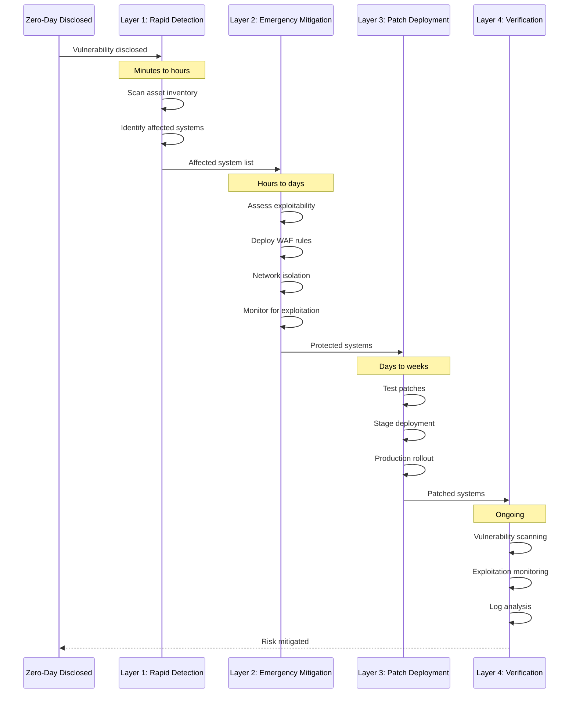

# Zero-Day Vulnerability Response Framework: Racing Against Weaponization

Zero-day vulnerabilities—security flaws unknown to vendors and without available patches—represent asymmetric warfare where attackers exploit while defenders scramble to respond. The window between public disclosure and widespread exploitation often measures in hours. Organizations that detect, assess, and mitigate zero-days faster than attackers can weaponize them survive. Those that don't become case studies.

## Real-World Attack Scenario

In December 2021, the Log4j vulnerability (CVE-2021-44228) emerged as one of the most critical zero-days in history. The vulnerability existed in Log4j, a ubiquitous Java logging library used across millions of applications worldwide. Attackers could achieve remote code execution by simply including a crafted string in any logged input—usernames, user agents, form fields. Within hours of public disclosure, attackers were scanning the internet for vulnerable systems.

Organizations faced an impossible timeline: identify all systems using Log4j (often buried deep in dependency chains), assess vulnerability severity for each instance, apply emergency patches or mitigations, and verify effectiveness—all while attackers were actively exploiting the vulnerability. Organizations that completed this cycle in days survived relatively unscathed. Those that took weeks or months suffered breaches.

## Defense Architecture

Zero-day response requires four defensive layers that operate on different timescales, from immediate mitigation to long-term patching:

### Layer 1: Rapid Vulnerability Assessment (PCI DSS 6.3.1, 11.3.1)

Asset inventory and dependency tracking enable rapid impact assessment when zero-days emerge. Complete inventories catalog all software components—operating systems, application frameworks, libraries, and dependencies. When Log4j was disclosed, organizations with accurate inventories identified affected systems in hours. Those without inventories spent weeks hunting for Log4j instances buried in application dependency chains.

Software Bill of Materials (SBOM) provides component-level visibility. Modern applications incorporate hundreds of dependencies, creating transitive dependency chains where applications depend on libraries that depend on other libraries. Log4j appeared dozens of layers deep in some dependency chains. SBOMs make these chains visible, enabling quick answers to "do we use this component anywhere?"

Automated vulnerability scanning detects known vulnerabilities across the environment. When new CVEs are published, scanners update their detection signatures and re-scan the environment, identifying newly vulnerable systems. This automation compresses vulnerability identification from manual investigation to automated detection.

**Use Case:** A payment processor maintains comprehensive asset inventory with automated SBOM generation for all applications. When Log4j was disclosed Friday evening, their security team queried the SBOM database: "which applications have Log4j dependencies?" The query returned results in seconds: 23 applications with direct or transitive Log4j dependencies, complete with version numbers and network locations. By Saturday morning, they had completed impact assessment and begun mitigation. Organizations without SBOM spent days or weeks identifying vulnerable systems while attackers were actively exploiting.

### Layer 2: Emergency Mitigation (PCI DSS 1.2.1, 6.6, 11.5)

Temporary controls reduce risk while permanent patches are tested and deployed. Emergency mitigations include:

- **WAF rules:** Block known exploitation attempts at the perimeter
- **IDS/IPS signatures:** Detect and prevent exploitation traffic
- **Network segmentation:** Isolate vulnerable systems from attacker reach
- **Service disabling:** Temporarily disable vulnerable functionality when business impact is acceptable
- **Configuration changes:** Apply vendor-recommended mitigations that don't require code changes

For Log4j, emergency mitigations included WAF rules blocking common exploitation patterns (JNDI lookup strings), disabling JNDI lookups via configuration flags, and network egress blocking to prevent successful exploits from communicating with command-and-control infrastructure.

Mitigation effectiveness requires continuous monitoring. Attackers adapt exploitation techniques to bypass mitigations. The cat-and-mouse game between exploitation and mitigation continues until patches are deployed. Organizations monitor for both successful exploits (suspicious outbound connections, unexpected process execution) and failed attempts (blocked by mitigations), adapting mitigations as attack techniques evolve.

**Real-World Example:** The 2017 WannaCry ransomware exploited EternalBlue, an NSA-developed exploit for Windows SMB protocol leaked months earlier. Microsoft had released patches, but many organizations hadn't deployed them. When WannaCry launched, it spread through vulnerable systems globally in hours. Organizations that had deployed patches months earlier were immune. Those that hadn't suffered massive disruption—the UK's National Health Service, Spanish telecommunications, FedEx, and hundreds of thousands of other victims. The attack demonstrated that patch deployment speed directly determines exposure to weaponized zero-days.

### Layer 3: Rapid Patch Deployment (PCI DSS 6.3.3, 6.5.1)

Efficient patch management compresses the vulnerability window. Organizations that deploy patches faster than attackers can weaponize vulnerabilities avoid exploitation. Rapid deployment requires:

- **Test environments:** Validate patches don't break functionality before production deployment
- **Staged rollout:** Deploy to small canary groups, verify stability, expand gradually
- **Automated deployment:** Use configuration management and orchestration tools for consistent, rapid deployment
- **Rollback procedures:** Enable quick recovery if patches cause issues
- **Emergency change processes:** Streamlined approval for critical security patches

Patch prioritization focuses resources on highest-risk vulnerabilities. CVSS scores provide severity ratings, but contextual factors matter more: Is the vulnerable component internet-facing? Does it process cardholder data? Is exploitation in the wild? Are exploit tools publicly available? High-severity vulnerabilities in internet-facing payment systems demand emergency patching. The same vulnerabilities in internal development tools might accept standard patch schedules.

**Use Case:** A SaaS payment platform maintains staging environments that mirror production infrastructure. When critical vulnerabilities emerge, they deploy patches to staging within hours, run automated test suites to verify functionality, monitor staging for 4-8 hours for issues, then deploy to production in rolling waves—10% of fleet, then 50%, then 100%—with automated rollback if error rates increase. For Log4j, they completed full production deployment in 36 hours from disclosure. Organizations without this pipeline took weeks to achieve the same results.

### Layer 4: Continuous Verification (PCI DSS 6.3.2, 11.3.1, 11.3.2)

Post-patch verification ensures mitigations and patches achieved their intended effect. Verification activities include:

- **Vulnerability rescanning:** Confirm patches eliminated vulnerabilities
- **Penetration testing:** Verify exploitation attempts fail
- **Log analysis:** Search historical logs for pre-patch exploitation evidence
- **Behavioral monitoring:** Detect post-exploitation activity from successful pre-patch attacks

Many organizations discover they were exploited before they patched. Log analysis for Log4j exploitation patterns revealed that attackers scanned vulnerable systems within hours of disclosure and successfully exploited many before patches deployed. Organizations that detect post-exploitation activity can contain breaches before attackers achieve their objectives.

Continuous monitoring detects patch deployment failures. Individual systems might fail to apply patches due to service outages, configuration issues, or deployment errors. Vulnerability scanning after patch deployment identifies systems that remain vulnerable, triggering remediation.

**Real-World Example:** The 2017 Equifax breach exploited Apache Struts vulnerability CVE-2017-5638. Apache released patches in March 2017. Equifax deployed patches to some systems but missed others due to inventory gaps. Attackers exploited the unpatched systems in May 2017, exfiltrating 147 million consumer records. The breach succeeded not because patches didn't exist—they were available for months—but because patch verification failed to detect incomplete deployment. The incident demonstrated that patch deployment without verification creates false confidence.

## Implementation Sequence

1. **Build comprehensive asset inventory** with automated discovery within 60 days (foundation for rapid assessment)
2. **Implement SBOM generation** for all applications within 90 days (dependency visibility)
3. **Deploy automated vulnerability scanning** with continuous monitoring within 60 days (detection capability)
4. **Establish emergency mitigation playbooks** for common vulnerability classes within 90 days (rapid response capability)
5. **Implement automated patch deployment** with staged rollout and rollback within 120 days (rapid remediation)

## Metrics That Matter

- **Asset inventory completeness:** Percentage of systems in inventory vs. actual systems (target 100%)
- **Vulnerability assessment latency:** Time from CVE disclosure to impact assessment completion (target <24 hours for critical CVEs)
- **Mitigation deployment time:** Time from vulnerability disclosure to emergency mitigation deployment (target <48 hours for internet-facing systems)
- **Patch deployment time:** Time from patch availability to production deployment (target <7 days for critical vulnerabilities, <30 days for high)
- **Patch verification rate:** Percentage of patched systems verified vulnerability-free (target 100%)

## Why Speed Matters More Than Perfection

Zero-day response is a race against weaponization. Attackers begin exploitation immediately upon disclosure. Every hour of delay increases breach probability. Organizations that complete the detection → mitigation → patching → verification cycle in days face minimal exploitation windows. Those that take weeks or months become breach statistics.

The goal is not perfect patching—that's impossible given the complexity of modern infrastructure. The goal is moving faster than the attacker weaponization timeline. If exploitation tools appear 48 hours after disclosure but your emergency mitigations deploy in 24 hours, you win. If patching takes 7 days but attackers need 10 days to weaponize, you win. If complete patching takes 30 days but your mitigations reduce successful exploitation probability by 95%, you lose only 5% instead of 100%.

Organizations with mature zero-day response don't prevent all exploitation attempts, but they shrink the exploitation window and reduce successful exploitation probability to levels where business operations continue despite active attack.
