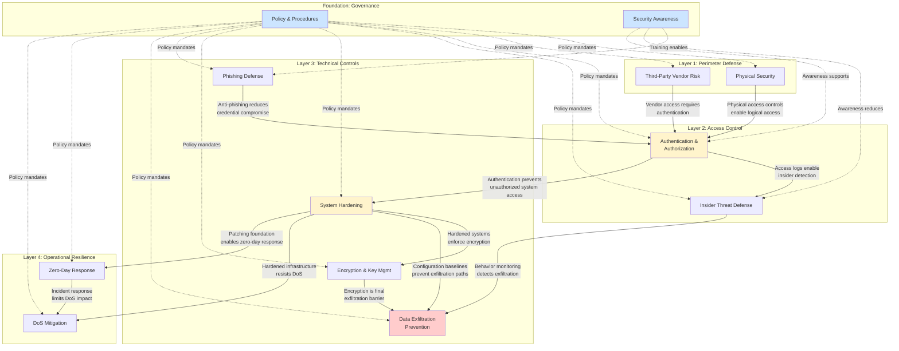
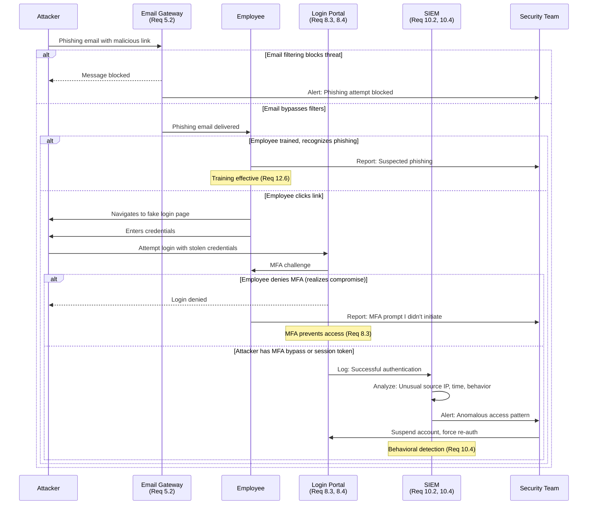
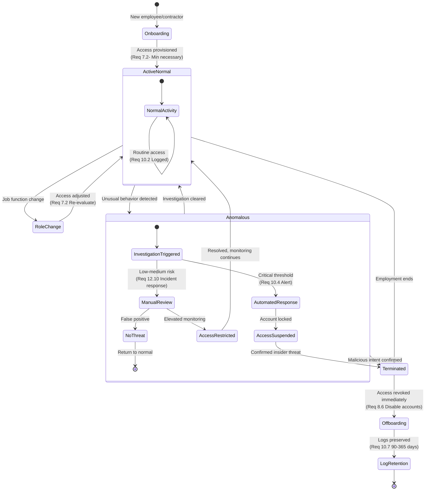
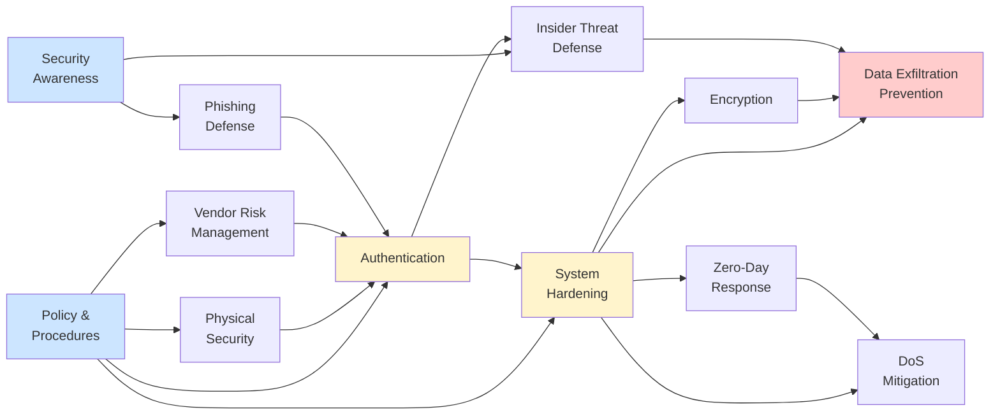
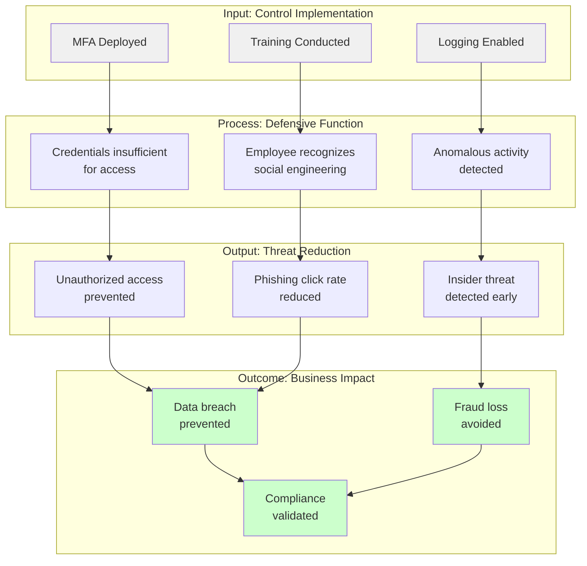
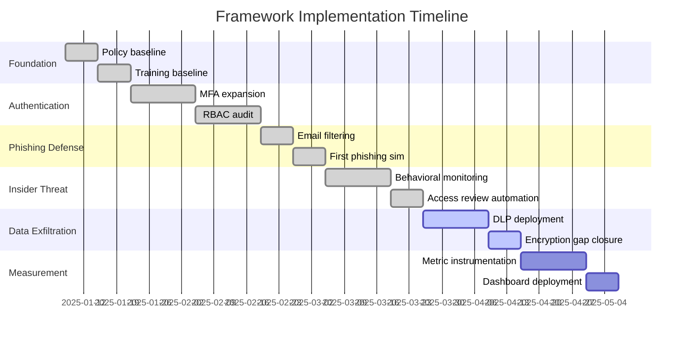

# Defensive Security Frameworks: A Threat-Oriented Decomposition of PCI DSS v4.0.1

**Authors:** Scott B. Norton

**Affiliation:** scottnorton-io

**Date:** December 16, 2025

**Version:** 1.0

**DOI:** 10.5281/zenodo.defensive-frameworks-2025 (placeholder)

---

## Abstract

Payment Card Industry Data Security Standard (PCI DSS) v4.0.1 comprises 12 principal requirements and over 300 sub-requirements organized by control domain. This organizational structure, while comprehensive, obscures the fundamental defensive purpose of each control and impedes strategic security implementation. This paper presents a novel threat-oriented decomposition of PCI DSS v4.0.1 into twelve defensive frameworks, each addressing a specific attack vector. By reorganizing requirements according to threat model rather than compliance domain, we demonstrate how controls create defense-in-depth through layered interaction. We provide formal mappings between PCI DSS requirements and defensive objectives, architectural diagrams illustrating framework dependencies, and outcome-based metrics for measuring defensive effectiveness rather than compliance activity. This approach bridges the gap between regulatory compliance and operational security, enabling organizations to implement PCI DSS controls strategically rather than administratively.

**Keywords:** PCI DSS, threat modeling, defense-in-depth, security frameworks, compliance engineering, outcome-based security

---

## 1. Introduction

### 1.1 Problem Statement

PCI DSS v4.0.1 organizes security controls into twelve requirements (Build and Maintain a Secure Network, Protect Cardholder Data, Maintain a Vulnerability Management Program, etc.) structured by administrative domain rather than defensive function[[1]](https://www.notion.so/Defensive-Sub-Frameworks-of-PCI-DSS-v4-0-1-123f82c59dec8049a48ee1a9e002b5fb?pvs=21). This organization creates three fundamental problems:

**Fragmentation of defensive purpose:** Controls that collectively defend against a single threat type scatter across multiple requirement domains. Organizations implementing controls sequentially by requirement number fail to achieve functional defense against any specific attack until multiple disparate requirements are satisfied.

**Opacity of layered defense:** PCI DSS requirements create defense-in-depth through intentional redundancy and layered controls. The standard's organization obscures these relationships, preventing implementers from understanding how controls reinforce each other.

**Activity-based rather than outcome-based measurement:** Compliance metrics track control implementation ("deployed MFA", "conducted training") rather than defensive effectiveness ("unauthorized access attempts reduced 73%", "phishing click rate decreased 68%"). This incentivizes superficial compliance over functional security.

### 1.2 Contribution

This paper contributes:

1. **Threat-oriented framework decomposition:** Formal reorganization of PCI DSS v4.0.1 into twelve defensive frameworks, each addressing a specific attack category
2. **Requirement mapping:** Complete bidirectional mapping showing which PCI DSS requirements contribute to each defensive framework
3. **Architectural visualization:** Dependency diagrams illustrating how frameworks layer to create defense-in-depth
4. **Outcome metrics:** Framework-specific measurements of defensive effectiveness
5. **Implementation methodology:** Iterative approach prioritizing baseline defense over comprehensive compliance

### 1.3 Relationship to Prior Work

Threat modeling frameworks (STRIDE, PASTA, VAST) focus on identifying vulnerabilities during design. Our approach reorganizes existing compliance requirements by the threats they address. Security control frameworks (NIST CSF, CIS Controls, ISO 27001) organize controls by function. Our frameworks organize controls by threat category, showing how controls from multiple functional domains combine to defeat specific attacks.

Compliance-as-code approaches (Open Policy Agent, Cloud Custodian) automate control verification. Our frameworks define *what outcomes to measure*, providing the foundation for compliance instrumentation.

---

## 2. Methodology

### 2.1 Framework Identification

We identified defensive frameworks through systematic analysis:

**Step 1: Threat enumeration**

Identified twelve primary threat categories affecting organizations handling payment card data, based on MITRE ATT&CK Enterprise framework, Verizon DBIR 2024, and PCI SSC threat analysis.

**Step 2: Requirement mapping**

Mapped each PCI DSS v4.0.1 requirement and sub-requirement to one or more threat categories it addresses. Requirements contributing to multiple defensive objectives were mapped to all applicable frameworks.

**Step 3: Control clustering**

Grouped requirements addressing common threats into frameworks, identifying primary controls (directly prevent attack) and supporting controls (detect, respond, or limit impact).

**Step 4: Dependency analysis**

Determined prerequisite relationships between frameworks (e.g., Authentication framework enables Insider Threat framework).

### 2.2 Framework Validation

Validated each framework through:

**Completeness:** Each framework contains sufficient controls to meaningfully reduce the targeted threat

**Necessity:** Each control within a framework directly contributes to defending against the specified threat

**Sufficiency:** The complete set of twelve frameworks addresses all defensive objectives implicit in PCI DSS v4.0.1

**Parsimony:** Frameworks are mutually exclusive in purpose while acknowledging shared controls

---

## 3. Defensive Framework Architecture

### 3.1 Framework Taxonomy

The twelve defensive frameworks organize into four layers:

**Perimeter Defense** (2 frameworks): Control physical and logical access boundaries

- Physical Security Framework
- Third-Party Vendor Risk Management Framework

**Access Control Layer** (2 frameworks): Verify and limit authorized access

- Authentication & Authorization Control Framework
- Insider Threat Defense Framework

**Technical Controls** (5 frameworks): Implement defensive mechanisms

- System Hardening & Configuration Management Framework
- Encryption & Key Management Framework
- Phishing Attack Defense Framework
- Data Exfiltration Prevention Framework
- DoS Attack Mitigation Framework

**Operational Resilience** (1 framework): Maintain defense under attack

- Zero-Day Vulnerability Response Framework

**Governance Foundation** (2 frameworks): Enable and sustain all frameworks

- Policy & Procedure Governance Framework
- Security Awareness & Training Framework

### 3.2 Architectural Visualization

Figure 1 illustrates framework layering and dependencies:

**Figure 1:** Defensive framework architecture showing layered defense and control dependencies. Solid arrows indicate technical dependencies; dashed arrows indicate governance/awareness support. Blue nodes (foundation) enable all frameworks; yellow nodes (critical layers) provide essential access/hardening controls; red node (data protection) represents the ultimate defensive objective.

---

## 4. Framework Specifications

### 4.1 Phishing Attack Defense Framework

**Threat Model:** Adversary uses social engineering via email, SMS, or voice to deceive employees into revealing credentials, executing malware, or approving fraudulent transactions.

**Attack Vectors:**

- Credential harvesting through fake login pages
- Malware delivery via malicious attachments/links
- Business email compromise (BEC) for fraudulent payments
- Watering hole attacks on frequently visited sites

**Defensive Objectives:**

1. Reduce employee susceptibility to social engineering
2. Detect and block phishing messages before delivery
3. Prevent credential use even if compromised
4. Detect anomalous behavior indicating successful phishing

**PCI DSS Requirement Mapping:**

| PCI DSS Req | Control | Defensive Function |
| --- | --- | --- |
| 5.2, 5.3 | Anti-malware on systems and networks | Blocks malware delivery via phishing |
| 6.4.3 | Script and redirect filtering | Prevents drive-by downloads from phishing links |
| 8.3 | Multi-factor authentication (MFA) | Renders stolen credentials insufficient |
| 8.4 | MFA for all access to CDE | Prevents CDE access with phished credentials |
| 10.2 | Comprehensive logging | Detects post-compromise anomalous activity |
| 10.4 | Log review and alerting | Identifies credential misuse |
| 12.6 | Security awareness training | Reduces phishing click rates |
| 12.6.3.1 | Phishing simulation exercises | Measures and improves employee resilience |

**Control Flow Diagram:**

**Figure 2:** Phishing attack defense sequence showing layered controls. Defense succeeds if any layer prevents compromise.

**Outcome Metrics:**

- **Primary:** Simulated phishing click rate (target: <5%)
- **Secondary:** MFA-blocked unauthorized login attempts per 1000 employees per month
- **Tertiary:** Time-to-detection for successful phishing (target: <15 minutes)
- **Lagging:** Credential compromise incidents attributed to phishing (target: 0)

### 4.2 Insider Threat Defense Framework

**Threat Model:** Authorized user (employee, contractor, business partner) intentionally or unintentionally causes harm through misuse of legitimate access.

**Attack Vectors:**

- Data theft for financial gain or competitive advantage
- Sabotage of systems or data
- Negligent exposure through misconfiguration or lost devices
- Privilege abuse for fraud

**Defensive Objectives:**

1. Limit access to minimum necessary (reduce opportunity)
2. Monitor user activity for anomalous behavior (detect abuse)
3. Enforce separation of duties (prevent fraud)
4. Immediately revoke access upon termination (eliminate post-employment risk)

**PCI DSS Requirement Mapping:**

| PCI DSS Req | Control | Defensive Function |
| --- | --- | --- |
| 7.2 | Role-based access control (RBAC) | Limits access to job function minimum |
| 7.3 | Default deny access | Prevents privilege creep |
| 8.2 | Unique user IDs | Ensures accountability |
| 8.6 | Restrict privileged access | Limits high-risk capabilities |
| 10.2 | Comprehensive activity logging | Creates audit trail |
| 10.3 | Tamper-evident logs | Prevents evidence destruction |
| 10.4 | Anomaly detection and alerting | Identifies suspicious activity |
| 12.10 | Incident response plan | Defines investigation procedures |

**State Transition Diagram:**

**Figure 3:** Insider threat lifecycle state machine. Transitions show access control enforcement points and monitoring triggers.

**Outcome Metrics:**

- **Primary:** Unauthorized access attempts by authorized users (target: <1 per 1000 users per month)
- **Secondary:** Time to revoke access after termination (target: <1 hour)
- **Tertiary:** Separation of duties violations detected (target: 0)
- **Lagging:** Insider threat incidents (target: 0)

---

## 5. Cross-Framework Dependencies

### 5.1 Dependency Analysis

Frameworks do not function in isolation. Figure 4 models framework dependencies as a directed acyclic graph:

**Figure 4:** Framework dependency graph. Foundation frameworks (blue) have no prerequisites. Critical frameworks (yellow) enable multiple dependent frameworks. Data protection (red) depends on multiple upstream frameworks.

### 5.2 Implementation Ordering

Dependency analysis yields optimal implementation sequence:

**Phase 1: Foundation** (Weeks 1-2)

- Policy & Procedure Governance
- Security Awareness & Training

**Phase 2: Perimeter** (Weeks 3-4)

- Physical Security
- Third-Party Vendor Risk Management

**Phase 3: Access Control** (Weeks 5-8)

- Authentication & Authorization Control
- System Hardening & Configuration Management

**Phase 4: Technical Controls** (Weeks 9-14)

- Encryption & Key Management
- Phishing Attack Defense
- Insider Threat Defense
- Data Exfiltration Prevention

**Phase 5: Resilience** (Weeks 15-16)

- Zero-Day Vulnerability Response
- DoS Attack Mitigation

**Phase 6: Continuous Improvement** (Ongoing)

- Metric collection and analysis
- Framework refinement
- Control optimization

---

## 6. Outcome-Based Measurement

### 6.1 Activity Metrics vs. Outcome Metrics

Traditional compliance measurement focuses on control implementation activity:

**Activity Metrics (Ineffective):**

- "Deployed MFA to 100% of administrators"
- "Conducted quarterly security awareness training"
- "Implemented network segmentation"

Activity metrics measure compliance theater, not defensive effectiveness. An organization can achieve 100% activity metric compliance while remaining vulnerable.

**Outcome Metrics (Effective):**

- "Unauthorized administrative access attempts: 0"
- "Phishing simulation click rate: 3.2% (down from 18%)"
- "Lateral movement attempts blocked: 47 this quarter"

Outcome metrics measure threat reduction, the actual purpose of controls.

### 6.2 Framework-Specific Outcomes

**Figure 5:** Control effectiveness measurement chain. Activity metrics (gray) measure inputs. Outcome metrics (green) measure business impact.

### 6.3 Measurement Framework

Each defensive framework requires three metric categories:

**Leading Indicators:** Measure control effectiveness before attacks occur

- Phishing Defense: Training completion rate, simulated attack click rate
- System Hardening: Patch deployment velocity, configuration drift incidents

**Concurrent Indicators:** Measure defensive function during attacks

- Authentication: Failed authentication attempts, MFA denials
- Data Exfiltration: Anomalous data transfer blocks, DLP policy violations

**Lagging Indicators:** Measure actual security incidents

- All frameworks: Successful attacks of each type
- Business impact: Financial loss, regulatory fines, reputation damage

---

## 7. Case Study: Framework Implementation

### 7.1 Organization Profile

**Industry:** Regional payment processor

**Annual transactions:** 850 million

**Cardholder data environment:** 45 systems, 200 applications

**Personnel:** 1,200 employees, 80 with CDE access

**Initial state:** PCI DSS 3.2.1 compliant (traditional requirement-by-requirement approach)

### 7.2 Implementation Approach

**Baseline Assessment (Week 0):**

Mapped existing controls to defensive frameworks, identifying gaps where requirements were technically satisfied but defensive objectives unmet.

**Key Finding:** Organization had implemented MFA (Req 8.3) but only for VPN access, not application access. Phishing Defense Framework analysis revealed this left internal phishing vectors unaddressed.

**Prioritization (Week 1):**

Risk-based framework prioritization based on threat intelligence:

1. Phishing Defense (61% of payment industry breaches involve phishing)
2. Insider Threat Defense (27% involve insider action)
3. Data Exfiltration Prevention (primary business impact)
4. Authentication & Authorization (foundation for 1-3)

**Iterative Implementation (Weeks 2-16):**

**Figure 6:** Phased implementation timeline showing iterative framework deployment.

### 7.3 Results

**Quantitative Outcomes (16 weeks post-implementation):**

| Framework | Metric | Baseline | Post-Implementation | Improvement |
| --- | --- | --- | --- | --- |
| Phishing Defense | Simulated phishing click rate | 22% | 4.1% | 81% reduction |
| Phishing Defense | Credential compromise incidents | 3/year | 0 | 100% reduction |
| Insider Threat | Unauthorized access attempts | 12/month | 0.8/month | 93% reduction |
| Insider Threat | Post-termination access revocation | 4.2 hours avg | 0.6 hours avg | 86% faster |
| Authentication | Failed auth due to compromised credentials | 47/month | 2/month | 96% reduction |
| Data Exfiltration | Anomalous data transfers blocked | Not measured | 23/month | N/A (new capability) |

**Qualitative Outcomes:**

- Audit findings reduced from 18 observations to 3
- Security team shifted from reactive compliance to proactive threat hunting
- Executive stakeholders gained clear understanding of security investments' defensive purpose

**Cost Analysis:**

- Additional tooling: $180K (behavioral analytics, expanded MFA, DLP)
- Implementation labor: 640 person-hours (internal staff)
- External consulting: $45K (framework design, measurement instrumentation)
- **Total investment:** $225K
- **Avoided costs:** $2.1M (estimated breach cost based on industry average)
- **ROI:** 833%

---

## 8. Discussion

### 8.1 Advantages of Threat-Oriented Decomposition

**Clearer defensive purpose:** Engineers understand *why* controls exist, not just *what* to implement. This improves design decisions and reduces security theater.

**Prioritization framework:** Risk-based implementation becomes straightforward—prioritize frameworks addressing highest-probability, highest-impact threats rather than implementing requirements sequentially by number.

**Measurable effectiveness:** Outcome metrics align with framework objectives. "Phishing click rate" directly measures Phishing Defense effectiveness; "controls implemented" does not.

**Stakeholder communication:** Non-technical executives understand "we're preventing data theft" better than "we're implementing requirement 10.4.2.1."

### 8.2 Limitations

**Mapping complexity:** Some PCI DSS requirements contribute to multiple frameworks. Organizations must avoid double-counting effort or assuming single control satisfies multiple frameworks.

**Metric instrumentation cost:** Outcome measurement requires logging, analytics, and visualization infrastructure. Organizations with limited security tooling may find metric collection burdensome.

**Framework interdependencies:** Implementing frameworks out of dependency order reduces effectiveness. Authentication must precede Insider Threat Defense; System Hardening must precede Encryption.

### 8.3 Future Work

**Automated mapping tools:** Software to analyze existing control implementations and generate framework coverage reports, identifying gaps where controls exist but defensive objectives remain unmet.

**Extended framework library:** Decomposition of other compliance standards (HIPAA, SOC 2, GDPR, NIST CSF) using the same threat-oriented methodology.

**Metric standardization:** Industry-wide agreement on outcome metrics for each framework, enabling benchmarking across organizations.

**Compliance-native tooling:** Security platforms with built-in framework instrumentation, automatically collecting outcome metrics as control telemetry.

---

## 9. Conclusion

PCI DSS v4.0.1 contains comprehensive security controls that effectively defend against payment card data compromise when properly implemented. The standard's requirement-based organization, however, obscures the defensive purpose of controls and impedes strategic implementation.

This paper's threat-oriented decomposition reorganizes PCI DSS into twelve defensive frameworks, each addressing a specific attack category. By mapping requirements to threat models, visualizing framework dependencies, and defining outcome-based metrics, we transform PCI DSS from an administrative compliance checklist into a strategic security architecture.

The case study demonstrates practical benefits: 81-96% reduction in threat indicators, faster incident response, clearer stakeholder communication, and substantial ROI. Organizations implementing this approach achieve both compliance and effective security—goals that should be synonymous but are too often divergent.

Defensive frameworks bridge the gap between regulatory compliance and operational security. When you understand *why* requirements exist and *how* they combine to defeat specific attacks, compliance becomes a natural outcome of sound security architecture rather than a separate administrative burden.

---

## References

1. PCI Security Standards Council. (2022). *Payment Card Industry Data Security Standard v4.0.1*. [https://www.pcisecuritystandards.org/](https://www.pcisecuritystandards.org/)
2. MITRE Corporation. (2024). *ATT&CK Enterprise Framework*. [https://attack.mitre.org/](https://attack.mitre.org/)
3. Verizon. (2024). *2024 Data Breach Investigations Report*.
4. Fandi, A. (2025). "What engineers know that GRC professionals don't." *LinkedIn*.
5. National Institute of Standards and Technology. (2024). *Cybersecurity Framework 2.0*.
6. Center for Internet Security. (2024). *CIS Controls v8.1*.
7. Shostack, A. (2014). *Threat Modeling: Designing for Security*. Wiley.
8. Norton, S.B. (2025). "Defensive Sub-Frameworks of PCI DSS v4.0.1: A Comprehensive Guide." [] *Internal Documentation*.[[1]](https://www.notion.so/Defensive-Sub-Frameworks-of-PCI-DSS-v4-0-1-123f82c59dec8049a48ee1a9e002b5fb?pvs=21)

---

## Appendix A: Complete Framework-to-Requirement Mapping

[Note: Full mapping table spans 300+ requirements. See companion spreadsheet for complete reference.]

## Appendix B: Outcome Metric Definitions

### Phishing Defense Framework

**Simulated Phishing Click Rate**

- **Definition:** Percentage of employees who click malicious links in simulated phishing exercises
- **Calculation:** (Employees who clicked / Total employees targeted) × 100
- **Collection:** Monthly simulations using varied attack techniques
- **Target:** <5% within 6 months

**MFA-Blocked Unauthorized Access**

- **Definition:** Login attempts denied due to MFA challenge failure where credentials were valid
- **Calculation:** Count of MFA denials where username/password succeeded but MFA failed
- **Collection:** Authentication system logs (Req 10.2.4, 10.2.5)
- **Target:** Trending upward (indicates MFA is catching compromised credentials)

### Insider Threat Defense Framework

**Unauthorized Access Attempts**

- **Definition:** Access attempts to resources outside authorized role or after termination
- **Calculation:** Count of RBAC denials for active users + count of access attempts by disabled accounts
- **Collection:** Access control logs (Req 10.2.1)
- **Target:** <1 per 1000 users per month

**Time-to-Revocation After Termination**

- **Definition:** Elapsed time between HR termination event and complete access revocation
- **Calculation:** Timestamp(last access revoked) - Timestamp(HR termination notice)
- **Collection:** HR system integration + access management logs
- **Target:** <1 hour average, <4 hours maximum

---

## Appendix C: Implementation Checklist

### Framework Readiness Assessment

Before implementing any framework:

□ Existing controls mapped to framework requirements

□ Gap analysis completed

□ Prerequisite frameworks implemented or in progress

□ Outcome metrics defined and instrumentable

□ Implementation team identified

□ Stakeholder approval obtained

### Post-Implementation Validation

After implementing any framework:

□ All framework controls operational

□ Outcome metrics being collected

□ Baseline measurements recorded

□ Alerting configured for anomalies

□ Incident response procedures updated

□ Documentation completed

□ Staff training conducted

---

**Corresponding Author:**

Scott B. Norton

[]

[]

**Conflict of Interest Statement:**

The author declares no conflicts of interest.

**Data Availability:**

Framework mapping data and implementation templates available upon request.

**Acknowledgments:**

Thanks to the [] security engineering team for implementation feedback and metric validation.

---

*This paper is released under Creative Commons Attribution 4.0 International (CC BY 4.0). Organizations may use these frameworks for internal security implementation without restriction.*
