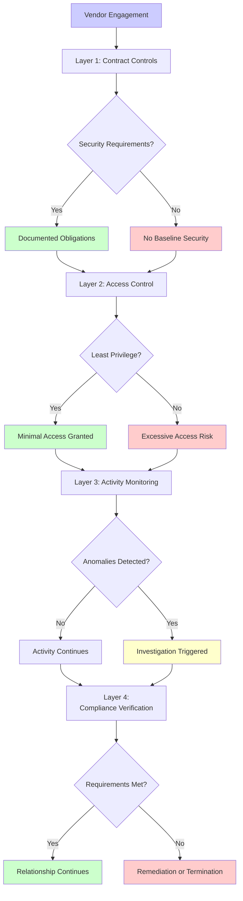

# vendor-risk-management.md

# Third-Party Vendor Risk Management Framework: When Trust Becomes a Vulnerability

Third-party vendors extend the security perimeter beyond organizational boundaries. Vendors require access to internal systems, handle sensitive data, and integrate with critical infrastructure. Each vendor relationship creates potential attack paths that bypass perimeter defenses. The 2013 Target breach demonstrated that world-class internal security means nothing when attackers enter through a trusted vendor's compromised credentials.

## Real-World Attack Scenario

Target's 2013 breach began with Fazio Mechanical Services, an HVAC contractor. Attackers compromised Fazio's network through a phishing email, stealing network credentials that Fazio used to access Target's vendor portal for electronic billing and contract submission. Those credentials granted access to Target's internal network. Attackers moved laterally from the vendor portal to Target's point-of-sale network, installed memory-scraping malware, and exfiltrated 40 million payment cards over three weeks.

The breach succeeded because Target's vendor risk management focused on contract terms and compliance certifications rather than technical access controls. Fazio needed access to billing systems but instead received network credentials that permitted lateral movement. Target monitored its own network for threats but didn't detect suspicious activity from trusted vendor connections. The attack revealed that security is only as strong as the weakest vendor relationship.

## Defense Architecture

Vendor risk management requires four control layers throughout the vendor lifecycle, from initial engagement through ongoing monitoring:

### Layer 1: Vendor Due Diligence & Contracts (PCI DSS 12.8.2, 12.8.4)

Vendor selection establishes security baseline before access is granted. Due diligence assesses vendor security posture through questionnaires, compliance certifications, and security reviews. Organizations evaluate whether vendors implement controls appropriate to the data they'll access and services they'll provide.

Key assessment areas include:

- **Compliance certifications:** PCI DSS validation for payment processors, SOC 2 reports for cloud services, ISO 27001 for managed security services
- **Security practices:** Vulnerability management, patch management, incident response capabilities, employee background checks
- **Financial stability:** Vendor's ability to sustain security investments and respond to incidents
- **Subcontractor management:** How vendors manage their own third-party relationships
- **Incident history:** Past breaches or security incidents and vendor response quality

Contracts codify security requirements as enforceable obligations. Written agreements must specify:

- **Data handling requirements:** Encryption standards, retention limits, disposal procedures
- **Access restrictions:** What systems vendors can access and under what circumstances
- **Security control obligations:** Specific controls vendors must implement
- **Incident notification:** Timeframes for notifying the organization of vendor breaches
- **Audit rights:** Organization's right to assess vendor compliance
- **Liability and insurance:** Financial responsibility for breaches originating from vendor

**Use Case:** A payment gateway provider evaluates a new fraud detection vendor. Due diligence reveals the vendor achieved PCI DSS Level 1 Service Provider validation and maintains SOC 2 Type II certification. However, security questionnaire responses show the vendor doesn't enforce multi-factor authentication for administrative access. The payment gateway requires MFA implementation as a contract prerequisite before granting access to transaction data. Contract includes quarterly attestation that MFA remains enforced, with audit rights to verify.

### Layer 2: Least Privilege Access Control (PCI DSS 7.2, 8.2, 12.8.2)

Vendor access follows the principle of least privilege—vendors receive only the minimum access required for their specific business function. HVAC contractors need access to building management systems, not network infrastructure. Payment processors need API access to transaction data, not direct database connectivity. Cloud service providers need access to hosted applications, not corporate network admin credentials.

Access implementation strategies include:

- **Dedicated vendor networks:** Isolated network segments with restrictive firewall rules limiting vendor access to specific systems
- **Jump boxes/bastion hosts:** Vendors access internal systems through hardened intermediary systems with comprehensive logging
- **API-only access:** Vendors interact through defined APIs rather than direct system access, limiting functionality to documented interfaces
- **Time-limited credentials:** Vendor access credentials expire automatically, requiring renewal for ongoing access
- **No shared credentials:** Each vendor employee receives individual credentials enabling attribution and immediate revocation when vendor personnel change

Multi-factor authentication must apply to all vendor remote access, preventing credential compromise from granting immediate access. Vendors authenticate with something they know (password), something they have (token), or something they are (biometric) before accessing any internal systems.

**Real-World Example:** After the Target breach, retailers revised vendor access strategies. Where previously vendors might receive VPN credentials with broad network access, new approaches provide vendors with role-specific access through dedicated portals. An HVAC vendor accesses building management interfaces through a web portal that provides only necessary functionality, with all access logged and monitored. The vendor cannot access other network segments, cannot move laterally, and their access automatically revokes if unused for 30 days.

### Layer 3: Continuous Monitoring (PCI DSS 10.2, 10.6, 12.8.5)

Vendor activity monitoring detects misuse of legitimate access. Logging captures all vendor actions—authentication events, data access, system changes, and network connections. Behavioral analytics establish baselines for normal vendor activity patterns, flagging anomalies for investigation.

Monitoring indicators include:

- **Access timing:** Vendors accessing systems outside normal business hours or contracted service windows
- **Access volume:** Unusual increases in data queries, downloads, or system modifications
- **Access scope:** Vendors accessing systems or data outside their contracted scope
- **Geographic anomalies:** Vendor access from unexpected locations
- **Failed access attempts:** Multiple authentication failures suggesting credential guessing or compromise
- **Privilege escalation:** Vendors attempting to gain elevated permissions beyond granted access

Automated alerting enables rapid response. When a vendor account exhibits suspicious behavior—a payroll processing vendor suddenly downloading customer contact lists—security teams receive immediate notification, can investigate in real-time, and suspend vendor access if necessary while investigation proceeds.

Security operations centers integrate vendor activity into broader threat detection. Vendor access combined with other indicators—malware alerts, data exfiltration attempts, unusual network traffic—triggers investigation. The Target breach would have been detectable through correlation: vendor credentials authenticating, followed by lateral movement attempts, followed by malware execution on POS systems.

**Use Case:** A SaaS payment platform monitors all vendor API access. A customer support vendor typically accesses 50-100 customer records per day during business hours, 9 AM - 6 PM EST. Monitoring detects anomaly: the vendor's API key queries 10,000 customer records at 2 AM on Sunday. Automated alert triggers immediate investigation. Security team suspends the API key, notifies the vendor, and investigates. Turns out a vendor employee's laptop was compromised, and attackers used stored API keys to exfiltrate customer data. Because detection occurred within minutes and the API key was immediately revoked, attackers obtained only the initial 10,000 records rather than the complete database of 5 million customers.

### Layer 4: Ongoing Compliance Verification (PCI DSS 12.8.1, 12.8.3, 12.8.4)

Annual compliance reviews verify that vendors maintain security controls throughout the relationship. Initial due diligence establishes security baseline, but vendors' security posture changes over time. Budget cuts reduce security staffing, acquisitions introduce new subcontractors, incidents reveal control gaps. Regular reviews detect security degradation before it creates risk.

Compliance verification activities include:

- **Annual questionnaire updates:** Vendors confirm controls remain in place and disclose changes
- **Compliance certification renewal:** Verify vendors maintain PCI DSS, SOC 2, or other relevant certifications
- **On-site assessments:** For highest-risk vendors, independent assessment of control implementation
- **Incident disclosure review:** Ensure vendors reported all security incidents per contract obligations
- **Subcontractor changes:** Understand new fourth-party relationships introduced since last review
- **Security metric trending:** Track vendor security metrics over time, identifying degradation

Risk-based review frequency aligns effort with vendor risk level. Vendors with access to live cardholder data receive quarterly reviews, while vendors accessing only public-facing websites receive annual reviews. Vendors in countries with elevated cyber threat levels receive enhanced scrutiny.

Remediation processes address identified gaps. When annual review reveals a vendor disabled MFA, the organization provides timebound remediation requirements: restore MFA within 30 days or face access suspension. Contracts specify that persistent non-compliance constitutes material breach, enabling relationship termination.

**Real-World Metrics:** Organizations with mature vendor risk programs typically manage 50-500 vendor relationships with varying risk levels. High-performing programs maintain 100% compliance with annual vendor reviews, detect and remediate vendor control gaps within 30 days of identification, and experience zero breaches originating from vendor access over multi-year periods.

## Implementation Sequence

1. **Inventory all vendor relationships** with access to systems or data within 30 days (establish baseline)
2. **Classify vendors by risk level** based on data accessed and access granted within 60 days (prioritize effort)
3. **Implement least privilege access controls** for highest-risk vendors within 90 days (immediate risk reduction)
4. **Deploy vendor activity monitoring** with behavioral baseline establishment within 90 days (detection capability)
5. **Establish annual compliance review program** with risk-based frequency within 120 days (ongoing verification)

## Metrics That Matter

- **Vendor inventory completeness:** Percentage of vendors with documented risk assessments (target 100%)
- **Access provisioning latency:** Time from business justification to access grant (measure efficiency without sacrificing security)
- **Least privilege compliance:** Percentage of vendor accounts with only required access (target 100%)
- **Monitoring coverage:** Percentage of vendor access with logging and alerting enabled (target 100% for elevated risk)
- **Annual review completion:** Percentage of vendors reviewed on schedule (target 100%)
- **Vendor-originated incidents:** Number of security incidents originating from vendor access (target zero)

## Why Vendor Risk Management Is Not Optional

Third-party vendors will remain necessary. Organizations cannot develop all capabilities in-house, cannot operate without specialized service providers, and cannot avoid cloud infrastructure and SaaS applications. Vendor relationships are permanent fixtures of modern business operations.

The question is not whether to use vendors but how to use them safely. Organizations that treat vendor access as an extension of their own security perimeter—applying the same access controls, monitoring, and compliance verification to vendors as to employees—successfully leverage vendor capabilities without accepting vendor risk.

Organizations that treat vendor management as a procurement paperwork exercise rather than an operational security program continue experiencing breaches like Target. The HVAC contractor doesn't care about cybersecurity the way a payment processor does, but the attackers don't care about business functions when they're looking for entry points. Every vendor relationship is a potential attack path, and defense requires treating them accordingly.